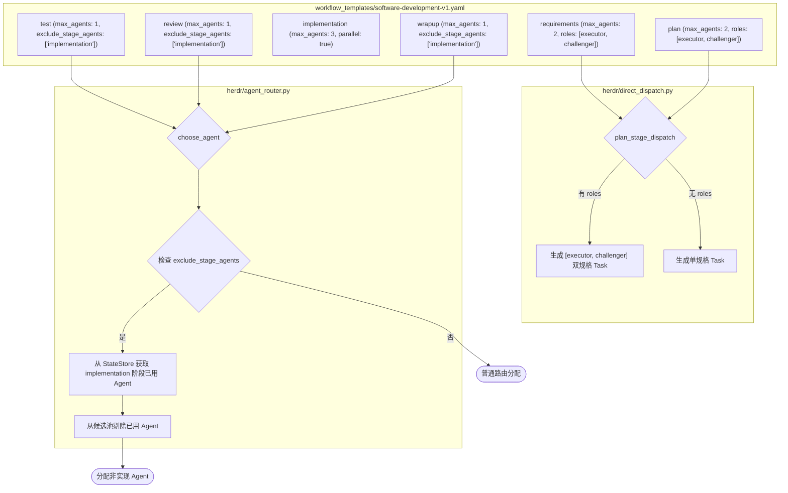

# 软件开发标准工作流优化设计文档
(Software Development Workflow v1 Optimization Design)

> **公司：上海共事智能科技有限公司**  
> **品牌：共事**  
> **产品：HAFlow**  
> **日期：2026-09-16**  
> **状态：已确认 (Approved)**  
> **分支：feat/software-dev-template-opt**  

---

## 1. 背景与目标 (Background & Motivation)

### 1.1 现状痛点
在既有的 `software-development-v1.yaml` 工作流模板中，每个阶段的 rules 均包含：
> `同一阶段允许多个 Task 使用不同 Agent 并行协作，不得默认把所有 Task 固定给同一个 Agent。`

并且多数阶段未设置明确的 `max_agents` 上限与工位职责边界。这导致：
1. **Pane 严重膨胀**：总指挥（Coordinator）在进入需求、计划甚至收尾阶段时，常常将任务细分切碎为 3~4 个 Task，在单个 WezTerm Tab 下切出 4+ 个分屏 Pane，导致终端界面拥挤、上下文混乱、API 限流与协调拖延。
2. **缺乏对抗性审查**：需求与计划阶段若仅由单一视角产出，容易漏掉极端边界、隐藏缺陷与架构死锁；若随意并发多 Agent 又造成重复编写与职责冲突。
3. **实现阶段并发不当**：未根据解耦程度动态判断，出现强耦合代码被强行多 Agent 并发修改引发 Git 冲突的问题。
4. **测试评审自审自查**：测试、评审与收尾阶段缺乏与实现阶段的强制 Agent 隔离机制，可能出现实现者（如 Codex）自己评审自己代码的盲区。

### 1.2 优化目标
1. **收敛每个 Tab 的 Pane 数量**：严格限定各阶段的工位数量上限，消除 Pane 膨胀。
2. **需求分析与计划阶段双工位（执行 + 对抗性质询）**：
   - 执行者（Executor）：产出核心规格/架构方案；
   - 对抗性质询者（Challenger）：破防性质询、深挖隐式假设、产出边界漏洞与可行性风险清单。
   - 严格限制最多 2 个 Task / 2 个 Pane，两份产出均完备方可通过门禁。
3. **实现阶段自适应并行**：
   - 高度解耦无重叠任务：允许并行多 Agent（上限 3 个）；
   - 强耦合或单点改动：严格单 Agent 顺序执行，禁止制造 Git 冲突。
4. **测试、评审与收尾阶段单工位 + 跨阶段 Agent 硬隔离**：
   - 严格单工位（1 个 Task / 1 个 Pane）；
   - 通过 `exclude_stage_agents: ["implementation"]` 策略与 Router 调度器硬拦截，绝不复用实现阶段 Agent，确保独立客观。

---

## 2. 节点规格与策略设计 (Node Specifications)

### 2.1 各阶段规格对照表

| 阶段 (Node) | 最大工位数 (`max_agents`) | 并发属性 (`parallel`) | 角色模式 | 产出物要求 | Agent 隔离策略 |
| :--- | :--- | :--- | :--- | :--- | :--- |
| **`requirements` (需求分析)** | 2 | `true` | `executor` (主执行)<br>`challenger` (对抗质询) | 1. 需求规格与验收标准<br>2. 需求对抗审查与边界漏洞清单 | 无需排除 |
| **`plan` (计划制定)** | 2 | `true` | `executor` (主架构)<br>`challenger` (对抗审查) | 1. 技术架构与解耦任务拆解<br>2. 方案对抗审查与可行性评估 | 无需排除 |
| **`implementation` (代码实现)** | 3 | `true` | 按任务解耦动态派发 | 1. 代码实现与自测<br>2. 修改文件清单与说明 | 偏好实现类 Agent |
| **`test` (测试验证)** | 1 | `false` | 独立测试员 | 1. 测试执行记录与缺陷清单<br>2. 回归测试结论 (PASS/FAIL) | `exclude_stage_agents: ["implementation"]` |
| **`review` (架构评审)** | 1 | `false` | 独立评审员 | 1. 架构合理性与安全评估<br>2. 代码规范审查结论 | `exclude_stage_agents: ["implementation"]` |
| **`wrapup` (收尾归档)** | 1 | `false` | 独立收尾员 | 1. 六步收尾报告 (含逐步状态表)<br>2. 最终成果说明与交付物汇总 | `exclude_stage_agents: ["implementation"]` |

---

## 3. 架构与组件变更 (Architectural Changes)



### 3.1 模板配置 (`workflow_templates/software-development-v1.yaml`)
- 在 `requirements` 与 `plan` 节点的 `agent_policy` 中声明：
  ```yaml
  agent_policy:
    preferred: [claude, qodercli, opencode, codex, agy, pi]
    max_agents: 2
    roles:
      - name: executor
        label: 主执行者
        purpose_suffix: 负责主干内容输出、需求澄清与方案制定
        outputs:
          - 需求规格与验收标准 (requirements) / 技术架构与解耦任务规划 (plan)
      - name: challenger
        label: 对抗性质询者
        purpose_suffix: 负责破防性质询、深挖隐式假设、漏洞挖掘与可行性风险审查
        outputs:
          - 对抗审查与边界漏洞清单 (requirements) / 方案对抗性审查与可行性风险评估 (plan)
  ```
- 在 `test`、`review`、`wrapup` 节点的 `agent_policy` 中声明：
  ```yaml
  agent_policy:
    max_agents: 1
    exclude_stage_agents: [implementation]
  ```
- 在各阶段 `rules` 中彻底移除诱导无序膨胀的 `同一阶段允许多个 Task 并行协作`，替换为严格的工位数与隔离红线。

### 3.2 路由器增强 (`herdr/agent_router.py`)
在 `choose_agent` 函数中：
1. 解析 `node_policy.get("exclude_stage_agents")` 或 `node_policy.get("disallow_from_stages")`；
2. 若存在此配置且传入了 `workflow_id`：
   - 从 `_get_store().list_tasks()` 中筛选属于当前 `workflow_id` 且 `node` 或 `stage` 落在排除阶段列表中的所有任务；
   - 收集这些任务已分配的 Agent（例如 `stage_used_agents = {'codex'}`）；
   - 从可用候选列表 `candidates` 中剔除 `stage_used_agents`；
3. **弹性与保护边界**：
   - 若过滤后的候选列表仍有可用健康 Agent，严格使用过滤后的候选列表进行负载均衡与分配；
   - 若系统仅配置了单一健康 Agent（例如单 Agent 调试或受限环境，过滤后列表为空），打印警告日志并平稳降级使用原 Agent，绝不导致系统无可用 Agent 死锁；
   - 若调用方显式指定了 `--agent <name>` 且与排除名单冲突，在存在其他可用 Agent 时进行拦截或告警。

### 3.3 规则化派发引擎增强 (`herdr/direct_dispatch.py`)
在 `plan_stage_dispatch` 函数中：
1. 检查节点是否配置了 `roles`（如 `agent_policy.get("roles")`）；
2. 若存在 `roles`：
   - 依次遍历各角色定义，生成对应的规范化 Task Spec；
   - 任务 ID 分别形如 `{workflow_id}-{node_id}-executor` 与 `{workflow_id}-{node_id}-challenger`；
   - 任务 Prompt 注入对应角色的职责说明与验收交付物清单；
   - 返回 `specs: [executor_spec, challenger_spec]`，一次性规则化直接派发双工位；
3. 若无 `roles`：
   - 保持原有的单 Spec 规则化直接派发逻辑不变，100% 保持既有行为与测试兼容。

---

## 4. 验证与测试策略 (Verification & Testing)

1. **模板规范与 DAG 合法性测试**：
   - 加载新版 `software-development-v1.yaml`，验证 `validate_workflow_dag` 顺利通过；
   - 验证 6 个节点的 `max_agents`、`roles`、`exclude_stage_agents` 字段结构完备。
2. **路由器跨阶段隔离测试** (`tests/test_agent_router_stage_exclusion.py`)：
   - 构造包含 `implementation` 任务（使用 `codex`）的 Workflow；
   - 请求 `test` 和 `review` 阶段的 `choose_agent`，验证返回结果绝不是 `codex`（如分配 `claude` 或 `opencode`）；
   - 模拟单 Agent 极端边界，验证降级保护机制不发生抛错阻断。
3. **规则化直接派发双工位测试** (`tests/test_direct_stage_dispatch.py`)：
   - 针对配置了 `roles` 的节点调用 `plan_stage_dispatch`，验证产出恰好 2 个带有不同角色职责的 specs；
   - 验证无 `roles` 节点的派发行为不受任何回归影响。
4. **全量回归验证**：
   - 运行 `pytest`，确保全仓 500+ 个单元与集成测试 100% 保持绿灯。
