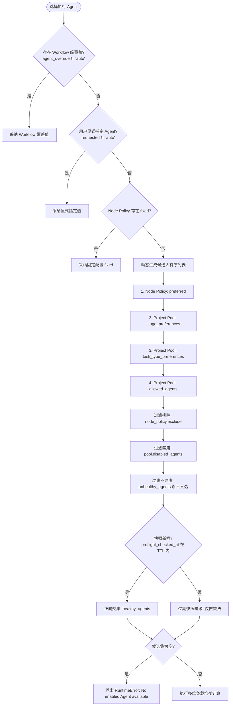

# 异构 Agent 路由策略与并发锁 (agent-routing-and-pools.md)

> **公司：上海共事智能科技有限公司**  
> **品牌：共事**  
> **产品：HAFlow**  
> **一句话：让人和多个 AI Agent 一起把事情做完**  
> *Human + Agent, in Flow*  
> **多 Agent 调度、优先级评分、负载均衡与 Reservation 预占锁**  
> 关联索引: [[index]] | [[domain-model]] | [[preflight-and-health]] | [[task-lifecycle]]

---

## 1. 路由优先级与选人决策树

在任务派发（`choose_agent`）时，系统按以下严格优先级梯次裁决执行 Agent：

Evidence:
- `herdr/agent_router.py#_candidate_order`
- `herdr/agent_router.py#choose_agent`
- `herdr/agent_router.py#preflight_snapshot_fresh`
- `tests/test_agent_router_preflight.py`

---

## 2. 负载均衡与最少活跃优先 (Least Loaded)

当产生多个合规候选 Agent 时，系统通过最小负载评分进行排序：
- `FACT` **活跃任务负载 (`active_loads`)**: 统计 `tasks.json` 中属于该项目且状态为未终结（`pending` 到 `cleanup_ready` 之间）的各 Agent 任务总数。
- `FACT` **锁预占负载 (`reserved_loads`)**: 统计 `agent-reservations.json` 中当前被预占但尚未落盘到 `tasks.json` 的各 Agent 数量。
- `FACT` **综合评分**:
  $$\text{Score}(Agent) = \text{ActiveTasks}(Agent) + \text{ReservedTasks}(Agent)$$
  具有最低综合得分的候选 Agent 将被优先选中；当得分相同时，维持候选顺序中靠前的 Agent。

Evidence:
- `herdr/agent_router.py#_active_agent_loads`
- `herdr/agent_router.py#choose_agent` (排序键: `active_loads + reserved_loads, item[0]`)

---

## 3. 并发死锁防御：Reservation 预占锁与 TTL

### 3.1 预占锁解决的核心冲突
在并发派发多个并行任务时，如果从“选定 Agent”到“写入 `tasks.json`”之间存在微秒级延迟，可能导致多个并行任务重复选中同一个空闲 Agent，瞬间造成单点过载。

### 3.2 锁与交接机制
`FACT` Herdr 引入了排他预占锁：
1. **获取排他锁**: 选人逻辑在 `fcntl.flock(lock.fileno(), fcntl.LOCK_EX)` 保护下执行。
2. **写预占记录**: 选中 Agent 后，立即在 `agent-reservations.json` 写入带时间戳的 Reservation。
3. **300 秒 TTL 自愈**:
   - `_clean_reservations` 每次遍历时，检查 Reservation 的 `created_at`。
   - 若某任务超过 300 秒仍未写入 `tasks.json`（例如 worker 进程中途崩溃），该预占锁强制自动释放，防止全局死锁。
4. **所有权平滑交接**:
   - 一旦 Task 成功注册到 `tasks.json`，清理函数检测到 `task_id in registered`，立刻将其从 reservations 中移除，无缝交接给 `tasks.json` 维持活跃计数。

Evidence:
- `herdr/agent_router.py#_clean_reservations`
- `herdr/agent_router.py#release_agent_reservation`
- `RULES.md:并发与死锁防御`

---

## 4. 门禁防御：Deep Preflight 强制健康检查

> [!WARNING]
> **No READY Agent 路由阻断机制**  
> 如果工作流实例记录了 `healthy_agents`，选人系统将强制拒绝任何未出现在健康列表中的 Agent。若所有 Agent 均因 Token 耗尽或登录失效而未通过体检，路由将主动阻断抛错，防止向不可用环境盲目派发任务造成状态卡死。

### 4.1 减法优先与快照时效（2026-09-17 路由黑洞事故后加固）

`FACT` 健康门禁的候选过滤链为 **`allowed - disabled - unhealthy`** 的减法优先，再叠加正向交集：

1. **`unhealthy_agents` 永不自动入选**：即使 `healthy_agents` 为空（冷启动）或体检同时给出正向名单，
   workflow 记录中明确标记为不健康（如 `pi: AUTH_REQUIRED`、`codex: TOKEN_EXHAUSTED`）的 Agent
   一律不进入自动候选；显式 `--agent <bad>` 仍抛错阻断。
2. **正向名单只在快照新鲜时生效**：`preflight_checked_at` 距今超过 `HERDR_PREFLIGHT_TTL`（默认 1800s）
   时，`healthy_agents` 不再作为"只允许此集合"的限制（避免把任务锁死在数小时前健康、现在可能已全灭
   的旧集合），降级为"仅减去 unhealthy"；时间戳缺失或不可解析视为新鲜，保持 legacy 记录与
   "单 Agent 环境优雅回退"语义不变。

背景：`wf-nexusarchive-0917-01` 的 test 节点被派给 `pi`（3 秒空完成 → 总指挥判定 failed），
人工 28 分钟后才重新派发 claude；根因是旧逻辑仅在 `healthy` 非空时做交集，坏 Agent 直接漏网。

Evidence:
- `herdr/agent_router.py#choose_agent`
- `herdr/agent_router.py#preflight_snapshot_fresh`
- `tests/test_agent_router_preflight.py`
- `docs/lessons/lessons-learned.md` §60

---

## 5. 投递熔断与基础设施失败自动补派

`FACT` **三条互补的存活保障链路**（详见 [[architecture]] §2.1/§2.2）：

1. **投递熔断（Sentinel）**：任务停留在 `dispatched` 超过 `HERDR_DISPATCH_DELIVERY_SLA`（默认 600s）
   且 Pane 无 `HERDR_ORCH_TASK:<task_id>` 标记、Agent 非 `working` → 置 `failed`
   （reason `dispatch_delivery_fuse`）并推送通知；有标记或已 working 只告警不处置。
   与既有 Nudge 互补：Nudge 覆盖"有标记但假死"，熔断覆盖"投递完全失败无标记"。
2. **基础设施失败自动补派（Controller）**：registry watcher 对 `failed` 任务调用纯选择器
   `select_infra_failures_for_recovery`（仅 `dispatch_delivery_fuse` / `agent_process_crash`，
   节点无活跃任务，谱系次数 < `HERDR_AUTO_RECOVER_MAX`），命中后 supersede 并清节点
   stage-advance 闩，由 sweep 补派 `-rN` 替代任务；质量类失败（测试 FAIL、总指挥判 failed）
   绝不自动翻案。
3. **纯函数 payload 化**：熔断判定与补派选择均在 `herdr/liveness.py` 以零 I/O 纯函数实现，
   便于零成本单测与回归。

Evidence:
- `herdr/liveness.py#evaluate_dispatch_fuse`
- `herdr/liveness.py#select_infra_failures_for_recovery`
- `services/herdr-sentinel.py#check_dispatch_fuse`
- `services/herdr-controller.py#recover_infra_failed_tasks`
- `tests/test_dispatch_fuse.py`

---

## 6. 门禁防御：Deep Preflight 强制健康检查（原始机制）

`FACT` 深度探针在工作流启动时对候选 Agent 做无副作用沙盒体检，结果写入 workflow 记录的
`healthy_agents` / `unhealthy_agents` / `preflight_checked_at`，由 §4.1 的选人链路消费。

Evidence:
- `herdr/preflight.py` / `herdr/deep_preflight.py`
- `CLAUDE.md:坑点 4：No READY Agent found 路由阻断`
- [[preflight-and-health]]

---

## 7. 自适应路由影子层（Adaptive Router v1, Shadow Mode）

`FACT` 每次 `choose_agent` 返回后，影子层基于 (agent × node/stage × task_type)
历史桶计算推荐并持久化 `route_decision` 事件；实际派发恒为旧 Router 结果，
影子异常时记 `route_decision_error` 并 fail-open。Qualified Success 要求
requirements + verification 双 true 且终态为 completed 类；未知 outcome 永不
默认成功；历史查询带 cutoff 并排除当前 run，防未来信息泄漏。

Evidence:
- `herdr/adaptive_router.py`
- `herdr/state_db.py#query_adaptive_history`
- `herdr/agent_router.py#choose_agent`
- `tests/test_adaptive_router.py`
- `docs/architecture/adaptive-agent-router.md`
