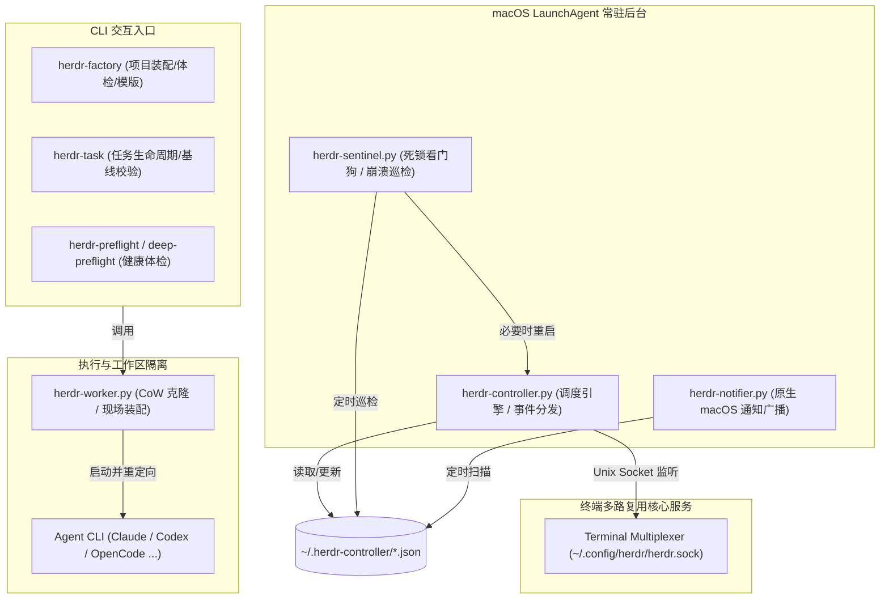

# 运行架构与进程拓扑 (architecture.md)

> **公司：上海共事智能科技有限公司**  
> **品牌：共事**  
> **产品：HAFlow**  
> **一句话：让人和多个 AI Agent 一起把事情做完**  
> *Human + Agent, in Flow*  
> **进程体系、通信机制与后台守护**  
> 关联索引: [[index]] | [[system-overview]] | [[task-lifecycle]] | [[tab-node-model]]

---

## 1. 进程拓扑与角色分层

HAFlow 系统的运行时由三种生命周期的进程构成：**CLI 工具链**、**常驻 LaunchAgent 守护进程**与**瞬时 Worker 任务进程**。

Evidence:
- `services/herdr-controller.py`
- `services/herdr-sentinel.py`
- `services/herdr-notifier.py`
- `services/herdr-worker.py`
- `CLAUDE.md:常用开发与运维命令`

---

## 2. 后台常驻守护进程详解

### 2.1 Herdr Controller (`services/herdr-controller.py`)
- `FACT` **核心职能**:
  1. **状态流转监听**: 维护与 Herdr Unix Domain Socket (`~/.config/herdr/herdr.sock`) 的持久连接，接收各 Pane 的实时 Agent 状态（如 `agent_done`, `error`）。
  2. **DAG 依赖推进**: 周期性扫描 `tasks.json`。当某节点的所有 Task 完成（状态到达 `cleaned` 或 `completed`）时，计算后续就绪节点（[[dag-workflow-engine]]）。
  3. **协调器注入**: 向项目总指挥 Pane (`coordinator_pane_id`) 输入结构化文本提示，指导总指挥 Agent 发起下一阶段 Task 派发。**2026-09-16 起降级为异常路径**：常规推进会优先走规则化直接派发（见下方 Direct Stage Dispatch），仅配置不足/需求缺失/launch 失败才回落总指挥。
  4. **重复防抖**: 利用 `stage-state.json` 记录 `queued` / `notified`，杜绝重复向总指挥发送推进指令。
- `FACT` **终态闸门（2026-09-13 幽灵推进事故后引入）**: 推进扫描只遍历注册表**非终态**条目（`herdr.projects.non_terminal_workflow_ids`，`status=="completed"` 视为终态）；`check_workflow_stage_advance` 对已关闭工作流早退；stage_advance 消费线程在**每次等待迭代**重新校验终态/注销，已入队事件在工作流关闭后被丢弃（`[STAGE ADVANCE DROP]`）。背景：零任务工作流对 `is_node_complete` 真空成立，无此闸门会被逐阶段"真空推进"并向共享协调者 Pane 注入幽灵提示，诱导其派发真实任务（wf-…-111426 事故，见 lessons §12）。
- `FACT` **Liveness Guard 控制面存活护栏（2026-09-16 6.5h 卡死事故后引入，lessons §41）**:
  策略与事件簿收敛在 `herdr/liveness.py`（纯逻辑）。三类机制：
  1. **有界等待 SLA**：总指挥事件投递与 stage advance 均设 SLA（默认 900s / 600s，env 可覆盖）；到期不再无限 `[COORDINATOR BUSY]` 空转，而是记录 attention 并释放 workflow 调度锁；
  2. **attention episode 投递保证**：投递失败/停滞写入 `~/.herdr-controller/attention.json`（attempts / next_retry_at），registry watcher 按指数退避慢速补投；`done` / `blocked` / `interrupted|paused` 事件均受此护栏，送达即清除；
  3. **注册表卫生**：夹具/临时 workflow（pytest-*、/tmp、已删除 workflow_file、无 project_id 空壳）不进入调度 sweep；`[WORKFLOW COMPLETE]` 单次闩；僵尸 pane 订阅指数退避封顶（2s→300s，8 次后慢重试一次告警）。
  启动时执行 `herdr integration status` 健康检查，缺失集成打印 `[INTEGRATION GAP]`（缺集成 → 屏幕探测误判是本次事故直接根因）。
- `FACT` **Direct Stage Dispatch 规则化推进会（2026-09-16 延迟优化，lessons §42）**:
  1. **常规推进（`[STAGE ADVANCED DIRECT]`）**：`herdr/direct_dispatch.py` 纯函数按节点模板（purpose / required_outputs / rules / default_task_type / default_integration_mode）与需求正文生成 Task 规格（节点字段为空时回退 `stage-policies.json`，兼容历史 workflow.json 旧快照），Controller 直接调用 `herdr-task launch`，不再等待总指挥 LLM 回合；fix-loop 回流时只补派"被作废且无替代"的子集任务（`-rN` 命名），`verdict=pass` 且已落定的任务保留（`[FIX LOOP SUBSET KEEP]`）；
  2. **例外回落**：节点无 purpose、需求正文缺失、legacy stages 路径、launch 非零退出才回落总指挥注入（`[DIRECT DISPATCH FALLBACK]`）；节点已有活跃任务时为 `wait` 模式（不注入、直接标记 notified）；`HERDR_DIRECT_STAGE_DISPATCH=0` 整段回退旧路径；
  3. **决策等待校准**：`wait_for_coordinator_decision` 默认预算 30s → 180s（`HERDR_COORDINATOR_DECISION_TIMEOUT`），超时不再立即重试，写入 attention（`decision_timeout`）按 `HERDR_ATTENTION_RETRY_INTERVAL` 退避；
  4. **提交门禁拆分**：Git 集成任务的 commit 由 Controller 下发 `HERDR_DEFER_HEAVY_TESTS=1`（目标仓 hook 识别该显式开关，不做仓库来源猜测，人类/Agent 手工提交仍走全量门禁），全量测试交给 workflow test 节点与 pre-push 门禁；
  5. **唤醒守卫**：存在活跃 workflow 时 Controller 持有 `caffeinate -i -s -w <pid>`（`[AWAKE GUARD]`），workflow 清零或进程退出自动释放，`HERDR_AWAKE_GUARD=0` 关闭。
- `FACT` **规则化验收 auto-accept（2026-09-17 引入，lessons §61）**:
  非门禁节点（requirements / plan / implementation 等无 gate 配置的节点）的
  `done` 事件不再必须排队等总指挥 LLM 回合：`herdr-task verify-baseline` 报告
  `TASK_CHANGED`（至少一个受控文件变更）即直接置 `completed` 并走既有
  finalize 链路（`[AUTO ACCEPT]`）。门禁节点（test/review/wrapup）与证据不足
  （`BASELINE_MATCH`）、配置不可判定的场景一律回落总指挥，绝不自动翻案；
  `HERDR_AUTO_ACCEPT=0` 整体关闭。背景：agent_done→completed 的总指挥验收
  等待实测占用 2.6h/8h，且其长回合会阻塞排在后面的门禁事件投递。
- `FACT` **被作废子集补派按谱系去重（2026-09-17 引入，lessons §61）**:
  `herdr/direct_dispatch.py#lineage_redispatch_candidates` 保证同一替换谱系
  （`x` / `x-r2` / …）最多只补派一发；旧逻辑会把历史作废任务反复补派，
  fix-loop 每轮 2→4→8 放大并发重复任务（[[dag-workflow-engine]] §4.3）。
- `FACT` **门禁规则化裁决 auto-verdict（2026-09-17 引入，lessons §62）**:
  门禁节点（test/review/wrapup）派发时注入结论契约
  （`herdr/direct_dispatch.py#gate_verdict_contract`：写 clone 外状态目录
  `~/.herdr-controller/gate-verdicts/<task_id>.json`（`HERDR_GATE_VERDICT_DIR` 可覆盖；
  权限受限时可退回 `<clone>/.herdr/gate-verdict.json`，该目录已被 `herdr-task` 内部过滤、
  不会进入交付）+ 终端输出 `HERDR_GATE_VERDICT: pass|blocked`）；`try_auto_verdict`
  合并文件（状态目录优先、clone 兜底）与屏幕两路信号，结论唯一一致时直接调用既有 CLI 契约
  `herdr-task set <task> completed --verdict ... --note ...` 落盘，blocked 自动进入既有
  fix-loop 回流。信号缺失/冲突、非门禁节点、`HERDR_AUTO_VERDICT=0` 一律回落总指挥。
  背景：门禁 verdict 过去必须由总指挥 LLM 从自然语言报告"转写"，566K tokens 上下文下单回合 10-20min。
- `FACT` **终化重试护栏全覆盖（2026-09-17 引入，lessons §63）**:
  `should_retry_finalize` 把 `committed` 与 `completed + integration_mode=git`
  统一纳入终化重试：episode 退避窗口外自动重跑幂等的
  `finalize_completed_task`（commit → rebase → integrate → cleanup），
  `HERDR_FINALIZE_RETRY_MAX`（默认 5）封顶，耗尽打印 `[FINALIZE RETRY EXHAUSTED]`
  并升级人工。背景：commit 门禁瞬时失败（flaky gate）曾让 `completed` 任务
  成为无重试死区，总指挥在一个 577K tokens 回合里手工重试 5 次、阻塞 65 分钟。
- `FACT` **close 等待 git 终化（2026-09-17 引入，lessons §65）**:
  `git_finalize_pending_tasks` 检查同 workflow 的 `completed`/`committed` + git 任务；
  命中则 `maybe_close_completed_workflow` 打印一次 `[CLOSE DEFERRED]` 并推迟，
  `close_workflow` CLI 同样 `[CLOSE ABORT]`。背景：wrapup 收官时后台 close 线程
  把 `completed` 任务抢先推进 `cleaned`，在跑的 `herdr-task commit` 子进程撞
  `Illegal transition: cleaned -> committed`，交付分支落不进集成链路。
- `FACT` **基础设施失败自动补派（2026-09-17 引入，lessons §60）**:
  registry watcher 对 `failed` 任务调用纯选择器 `herdr/liveness.py#select_infra_failures_for_recovery`
  （仅 `dispatch_delivery_fuse` / `agent_process_crash`，节点内无活跃任务，谱系失败次数 <
  `HERDR_AUTO_RECOVER_MAX` 默认 2，未 superseded）；命中后 `herdr-task supersede` 并清除该节点
  stage-advance 闩，由既有 sweep 的 direct dispatch 补派 `-rN` 替代任务（`[AUTO RECOVER]`）。
  质量类失败（test FAIL、总指挥判 failed）绝不自动翻案；此前 failed 任务只能人工
  `launch --supersedes`，实测造成 28 分钟级空等。
- `FACT` **创建闸门（herdr-factory 侧）**: `herdr-factory run` 在注册前持 per-project flock（`~/.herdr-controller/locks/<project_id>.workflow-create.lock`）原子执行「同项目活跃工作流检查 + 注册」；同项目已有非终态工作流时拒绝创建（exit 2，列出活跃工作流与处置指引），`--force` 显式 bypass（e2e 自动 bypass）。同项目工作流共享协调者 Pane 与阶段拓扑，默认必须串行。

### 2.2 Herdr Sentinel (`services/herdr-sentinel.py`)
- `FACT` **核心职能**:
  1. **崩溃模式拦截**: 每 3 秒巡检处于 `ACTIVE` 状态（`dispatched`, `working`, `blocked`, `rework`）的任务。
  2. **终端可见内容探测**: 通过 `herdr pane read <pane_id> --source visible` 捕获终端异常特征。
  3. **特征匹配**: 匹配 `"Bun has crashed"`, `"segmentation fault"`, `"panic(main thread)"` 等底层崩溃，并在 `tasks.json` 中标记 `sentinel_reason`，更新任务状态。
  4. **假死自动破冰 (Nudge Enter)**: 针对因按键卡顿处于假死状态的窗格，在超过 15 秒无响应时自动向 Pane 发送 `enter` 触发恢复。
  5. **停滞检测 (Stall Detector, 2026-09-16 引入)**: 对处于非终态且长时间（默认 1800s，env `HERDR_TASK_STALL_AFTER`）无任何状态推进的任务，打印 `[SENTINEL STALL]` 并推送 macOS 通知（补上此前"控制面停滞"完全失明的盲区）。
  6. **投递熔断 (Dispatch Delivery Fuse, 2026-09-17 引入, lessons §60)**: 对停留在 `dispatched` 超过 `HERDR_DISPATCH_DELIVERY_SLA`（默认 600s）的任务，先取证 Pane 屏幕（`_pane_delivery_evidence`：是否有 `HERDR_ORCH_TASK:<task_id>` 标记 + Agent 状态）；无标记且 Agent 非 `working` → 置 `failed`（reason `dispatch_delivery_fuse`，`[SENTINEL FUSE]`）并通知，有标记/已 working 只通知不处置；`HERDR_DISPATCH_FUSE=0` 关闭。与 Nudge 互补：Nudge 覆盖"有标记但假死"，熔断覆盖"投递完全失败无标记"（旧逻辑的最大盲区）。
  7. **自愈救援**: 发现 Controller 进程僵死时，主动执行 `launchctl kickstart -k` 重启 Controller。

### 2.3 Herdr Notifier (`services/herdr-notifier.py`)
- `FACT` **核心职能**:
  1. 异步轮询 `tasks.json`。
  2. 触发条件：当任务进入关注状态（`blocked`, `failed`, `human_review`, `needs_action`）或整个 Workflow 全部完成时。
  3. 通过 macOS 原生系统通知派发：优先使用 `terminal-notifier` 附带 `-open` 直达控制台 Deep-Link URL（`http://127.0.0.1:8765/?workflow_id=...&task_id=...`），未安装时安全降级为 `osascript`。

Evidence:
- `services/herdr-controller.py#main`
- `services/herdr-sentinel.py:CRASH_PATTERNS`
- `services/herdr-sentinel.py#nudge_enter`
- `services/herdr-notifier.py#notify`

---

## 3. 进程间通信与持久化契约

### 3.1 共享状态目录 (`~/.herdr-controller/`)
所有组件通过本地标准 JSON 文件通信与同步状态：

| 文件名 | 职责与归属 | 核心结构 |
| :--- | :--- | :--- |
| `tasks.json` | 全局工单状态机，所有组件的核心数据流 | `{"tasks": [Task, ...]}` |
| `projects.json` | 本地 Git 仓库到 Herdr Workspace/Coordinator 的映射中心 | `{"projects": {<root>: Project}}` |
| `workflows.json` | 运行中的工作流实例元数据 | `{"workflows": {<wf_id>: Workflow}}` |
| `stage-state.json` | Controller 内部阶段推进防抖状态 | `{<wf_id>:<stage>: "queued"\|"notified"}` |
| `attention.json` | Controller 的投递失败/总指挥停滞事件簿（Liveness Guard） | `{"episodes": {<task>:<event>: {attempts, next_retry_at, reason}}}` |
| `sentinel-state.json` | Sentinel 巡检状态（seen / nudged / stalls 停滞事件簿 / dispatch_fuse 投递熔断事件簿） | `{"seen": {}, "nudged": {}, "stalls": {<task_id>: {status, idle_seconds}}, "dispatch_fuse": {<task_id>: {waited_seconds, requeues, action}}}` |
| `agent-pools.json` | 各项目 Agent 白名单与偏好矩阵 | `{"projects": {<proj_id>: Pool}}` |
| `agent-reservations.json` | 动态预占锁中心（带 300s TTL） | `{"reservations": {<task_id>: Reservation}}` |
| `agent-router.lock` | 文件排他锁，保证并发分人安全 | `fcntl.flock` 目标文件 |

### 3.2 并发与原子写入保障
`FACT` 为防止多进程并发读写导致 JSON 损坏，代码中严格执行两种保护：
1. **原子替换**: 写入时先写 `<file>.tmp`，调用 `os.replace` 进行原子重命名。
2. **文件锁排他**: 对关键资源（如 `agent-reservations.json`）在读写前通过 `fcntl.flock(lock.fileno(), fcntl.LOCK_EX)` 获得独占锁。

Evidence:
- `herdr/agent_router.py#release_agent_reservation`
- `herdr/projects.py#_save`
- `services/herdr-sentinel.py#save_json_atomic`

---

## 4. 关键运维约束：LaunchAgent 进程生命周期

> [!CAUTION]
> **LaunchAgent 代码热更新陷阱**  
> 修改了 `services/herdr-controller.py` 或 `herdr/` 中的代码后，正在运行的后台 LaunchAgent **不会**自动热重载新代码，内存中仍旧跑着旧字节码！  
> **必须执行**: `launchctl kickstart -k gui/$(id -u)/com.user.herdr-controller`  
> **严禁操作**: 在终端直接执行 `python3 services/herdr-controller.py`（会导致多个 Controller 抢占同一个 Unix Socket 和状态文件）。

Evidence:
- `RULES.md:守护进程运维红线`
- `CLAUDE.md:坑点 1：LaunchAgent 进程更新陷阱`
