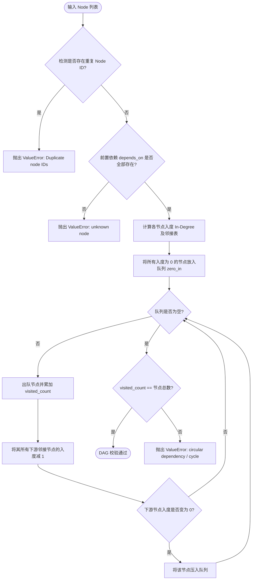

# DAG 工作流引擎与调度算法 (dag-workflow-engine.md)

> **公司：上海共事智能科技有限公司**  
> **品牌：共事**  
> **产品：HAFlow**  
> **一句话：让人和多个 AI Agent 一起把事情做完**  
> *Human + Agent, in Flow*  
> **模板规范、Kahn 拓扑校验算法、双向归一化与就绪推进**  
> 关联索引: [[index]] | [[domain-model]] | [[task-lifecycle]] | [[architecture]]

---

## 1. 模板体系与加载发现

HAFlow 支持声明式 YAML 与 JSON 工作流模板。

### 1.1 模板扫描顺序
`FACT` 引擎通过 `herdr/workflow.py#list_templates` 自动发现模版：
1. **用户自定义目录**: `~/.herdr-controller/templates/`（具有最高优先级，覆盖同名内置模板）。
2. **仓库内置目录**: `workflow_templates/`（随代码仓库分发）。

已内置的标准模板包括：
- `software-development-v1.yaml`: 标准 6 阶段研发闭环（需求分析 ➔ 计划 ➔ 实现 ➔ 测试 ➔ 评审 ➔ 收尾）。
- `bidding.yaml`: 7 阶段标书制作与审批流程。
- `customer-service.yaml`: 客诉分流与处置流程。

Evidence:
- `herdr/workflow.py:USER_TEMPLATES_DIR`
- `herdr/workflow.py:BUNDLED_TEMPLATES_DIR`
- `tests/test_workflow_engine.py#test_list_templates_bundled`

---

## 2. DAG 拓扑校验与 Kahn 算法

`FACT` 在模板加载与运行时初始化阶段，系统调用 `validate_workflow_dag(nodes)` 强制执行拓扑约束校验：

Evidence:
- `herdr/workflow.py#validate_workflow_dag`
- `tests/test_workflow_engine.py#test_cycle_detection`
- `tests/test_workflow_engine.py#test_unknown_dependency`

---

## 3. 双向归一化适配器 (`normalize_workflow`)

### 3.1 历史兼容背景
在早期版本中，工作流以线性的 `stages` 列表表达（`[requirements, plan, ...]`），仅支持单一链式流转。  
新架构重构为通用的有向无环图 `nodes`，支持并行分支与多重聚合。

### 3.2 归一化逻辑
`FACT` `normalize_workflow(workflow)` 提供了透明的双向兼容：
- **若输入包含 `nodes`**:
  - 保留并校验 `nodes`。
  - 根据节点顺序自动生成对齐的向后兼容 `stages` 列表，为每个 stage 填充 `next` 指针。
- **若输入仅包含 legacy `stages`**:
  - 将每个 stage 自动转化为 `node_type = "agent"` 的现代 Node。
  - 自动将前一个 stage 设为后一个 stage 的 `depends_on` 前置依赖。
  - 提取 `stage_policies` 中的属性并注入各节点的 `agent_policy`。

Evidence:
- `herdr/workflow.py#normalize_workflow`
- `tests/test_workflow_engine.py#test_normalize_legacy_stages_to_nodes`
- `tests/test_workflow_engine.py#test_normalize_nodes_to_legacy_stages`

### 3.3 Execution & Context Contract (V1)

`FACT` `normalize_workflow` 在双向归一化之后叠加执行契约归一化
(`_normalize_execution_contract`)，模板因此除"怎么做"外还能声明
"跑在什么环境"与"需要什么业务上下文"：
- `execution.mode` 仅 `git` / `context` 两值；**缺省 `git`，旧模板行为字节级不变**。未知 mode 归一化时 ValueError。
- `context: {required, optional}` 声明上下文条目（`- id` 简写或 `{id, label}`），id 须匹配 `^[a-z][a-z0-9_-]{0,63}$`，跨 required/optional 去重；空声明不落地 `context` 键（保持幂等）。
- context 模式在**项目/Runtime 初始化之前**参与决策：`herdr-factory` 的 `resolve_project_for_template` 先 `load_template` + `execution_mode` 判模式，context 走 `ensure_context_project`（任意真实目录即可注册，不要求 Git 仓库），git 走原 `resolve_project` 路径。
- 运行期绑定经 `--context id=path`（可重复）传入，`validate_context_contract` fail-fast（required 缺失 → `Missing required context: …`；unknown 拒绝），路径解析为绝对后随 Workflow 实例持久化（StateStore `metadata_json` 自由键，无新增表）。
- context 与 git 的隔离是强制的：`validate_integration_for_execution` 拒绝 context+`integration_mode=git`；`herdr-task` 的 commit/integrate 对 context 任务直接 exit 2。

Evidence:
- `herdr/workflow.py#_normalize_execution_contract`
- `herdr/projects.py#ensure_context_project`
- `tests/test_execution_context_contract.py`

---

## 4. 就绪节点计算与推进 (`get_ready_nodes`)

### 4.1 推进规则
`FACT` 控制器在周期调度时，通过 `get_ready_nodes(workflow, completed_node_ids)` 计算当前时刻可以立刻并发派发的就绪节点：
一个 Node 满足就绪必须**同时**满足：
1. **未完成**: `node["id"] not in completed_node_ids`。
2. **全前置满足**: 节点的所有依赖项集合必须是已完成集合的子集：  
   `set(node.depends_on).issubset(completed_node_ids)`。

### 4.2 菱形与并行依赖支持
引擎天然支持菱形分支合并（Diamond Graph）模型：
- `Start` ➔ `Branch_A` & `Branch_B` ➔ `Merge`
- 当且仅当 `Branch_A` 和 `Branch_B` 均进入 `completed_node_ids` 时，`Merge` 节点才会返回在 `ready` 列表中。

Evidence:
- `herdr/workflow.py#get_ready_nodes`
- `herdr/workflow.py#is_workflow_completed`
- `tests/test_workflow_engine.py#test_join_waits_for_all_dependencies`

### 4.3 Direct Dispatch 边界

`FACT` 首次派发只接受 Agent 静态节点：有效角色列表生成固定角色 Task；无角色、`max_agents=1` 且不允许并行时生成单 Task。无固定角色但允许并行或上限不为 1 的节点回退总指挥规划，不生成通用 `-auto` Task。已有任务等待与既有被作废子集补派保持原行为。

`FACT` Controller 的 `stage_advance` 入口对非 Agent 节点输出 `STAGE ADVANCE BLOCKED`，要求人工处理，不调用 Direct Dispatch 或总指挥。该阻断不受 `HERDR_DIRECT_STAGE_DISPATCH` 开关影响；事件未携带 Node 时从工作流配置解析。它不实现 human/tool/gate 原生执行器，也不限制用户手动调用 CLI。

`FACT` 被作废子集补派必须按**替换谱系去重**（2026-09-17 指数放大事故后加固，
lessons §61）：同谱系（`x` / `x-r2` / `x-r3` …）内只要还有任一非 superseded
成员（在跑或已落定），该谱系视为已有代表，不再补派；仅当整个谱系都已作废时，
才取序号最新一发（且无 `superseded_by`）作为补派对象，生成 `-rN+1`。
旧逻辑直接遍历所有 `superseded` 且无替代的任务，且不看同谱系是否有在跑成员，
fix-loop 每轮都会把历史作废任务重新补派一遍（r2/r3 → r4+r5 双跑实测），
且随轮次 2→4→8 放大。

Evidence:
- `herdr/direct_dispatch.py#classify_dispatch`
- `herdr/direct_dispatch.py#plan_stage_dispatch`
- `herdr/direct_dispatch.py#lineage_redispatch_candidates`
- `herdr/direct_dispatch.py#lineage_key`
- `services/herdr-controller.py#_handle_coordinator_item`
- `tests/test_direct_stage_dispatch.py#PlanStageDispatchTest`
- `tests/test_direct_stage_dispatch.py#TryDirectStageAdvanceTest`

### 4.4 任务级门禁结论对称性

`FACT` 任务级 `blocked` 验收结论对自动推进一律有效，不问节点有无 gate 配置：
sweep 发现就绪节点的任一依赖存在未作废 blocked 结论时，不 queue、不作废下游，
只记 attention（`upstream_blocked`，可退避）并通知总指挥裁决，作废过期结论后自动恢复；
`try_direct_stage_advance` 在规划前复查同一条件，命中则 `DIRECT DISPATCH BLOCKED`
回退总指挥。未知依赖时保持原行为（fail-open）。fix-loop 的销毁式回流仍仅对有
gate 配置的节点（test/review/wrapup）触发。

Evidence:
- `services/herdr-controller.py#blocked_verdict_dep`
- `services/herdr-controller.py#check_workflow_stage_advance`
- `services/herdr-controller.py#try_direct_stage_advance`
- `tests/test_gate_verdict_symmetry.py`

## 10. 门禁 verdict 与 fix-loop 回路

`FACT` 阶段结论（pass/blocked）是 DAG 推进的一等输入，与任务完成态正交：
`is_node_complete` 只看任务状态，门禁判定在 `check_workflow_stage_advance`
的 ready-node 循环与 workflow 完成分支两处读取 verdict（详见
[[task-lifecycle]] §1.1）。blocked 的处理不是报错而是**结构回流**：原子作废
gate+下游任务 → 节点回归未完成 → 既有 `reconcile_stage_advance_states` +
`get_ready_nodes` 机制驱动 DAG 在 fix 完成后自动重流，无需新状态机状态。

`FACT` **门禁结论契约化（2026-09-17 引入，lessons §62）**：门禁节点的 verdict
不再必须由总指挥 LLM 从自然语言报告转写。派发时（`gate_contract=True`）注入契约：
Agent 须写 clone 外状态目录 `~/.herdr-controller/gate-verdicts/<task_id>.json`
（`HERDR_GATE_VERDICT_DIR` 可覆盖；权限受限时退回 `<clone>/.herdr/gate-verdict.json`）
并在终端输出 `HERDR_GATE_VERDICT: pass|blocked`；Controller 的 `try_auto_verdict` 仅在
两路信号结论唯一一致时采纳，并经既有 CLI 契约
`herdr-task set <task> completed --verdict ... --note ...` 落盘（blocked 必须带 note）。
缺失/冲突回落总指挥；`HERDR_AUTO_VERDICT=0` 关闭。存量在跑任务可用
`herdr-task steer` 补注入契约。clone 内 `.herdr/` 已被 `bin/herdr-task`
`INTERNAL_UNTRACKED_*` 过滤（commit / verify-baseline 均不计入），
避免门禁机器产物污染交付。

`FACT` **verdict 就绪即放行完成（2026-09-20 引入，lessons §73）**：门禁节点的
`required_outputs` 是人类契约标签（如"测试结论（PASS / FAIL）"）而非仓库相对路径，
产物就绪门禁（`check_task_deliverables_ready`，其路径语义只适用于文件型产出）对门禁节点
必然为假。`handle_event` 的完成推迟分支现改为
`if not check_task_deliverables_ready(task) and not gate_verdict_ready(task):` 才 DEFERRED：
门禁任务只要 `read_gate_verdict` 返回 pass/blocked 即视为完成证据，放行
`idle → agent_done` 进入既有 `try_auto_verdict` 收口，避免
"[COMPLETION DEFERRED] → superseded 重跑"式的既有结论丢失。不新增状态机分支。

Evidence: `herdr/direct_dispatch.py#GATE_VERDICT_CONTRACT` /
`services/herdr-controller.py#read_gate_verdict` / `#try_auto_verdict` /
`#gate_verdict_ready` / `tests/test_auto_acceptance.py#GateVerdictUnitTest` /
`tests/test_fix_loop_anti_flapping.py#ControllerReconcileReworkTest`

## 11. 交付 PR 前置（wrapup 节点的必做步骤）

`FACT` **交付 PR 前置（2026-09-17 引入，lessons §64）**：`software-development-v1`
模板的 wrapup 节点规则要求——在六步收尾步骤 1-2（知识沉淀 / wiki 回填并提交）之后、
步骤 3（合并确认）之前，必须完成「交付 PR」：

1. 读取目标仓库交付约定（`AGENTS.md` / `CLAUDE.md` / `docs/guides/*wrap-up*.md` /
   `package.json` scripts）；
2. 按标准流程把交付分支（集成分支链末端）推送到远端并创建 PR
   （如 nexusarchive：`npm run pr:create`；无项目脚本时用 forge CLI/API）；
3. PR URL 与目标 base 写入收尾报告与交付汇总；PR 无法创建时才记 DEFERRED。

硬约束：只允许「推送交付分支 + 创建 PR」两类非破坏性远端动作；**严禁自动合并**
（合入由作者/评审决定）；严禁 `--force` / `--yes`；不得改写交付分支历史。
`six-step-finish` 技能同步新增「步骤 0：交付 PR 前置」与三条常见借口兜底
（不代劳 PR 创建 / 不自动合并 / 未推送无 PR 先跑脚本）。

背景：HAFlow 全链路此前没有任何 `git push`（`herdr-task integrate` 只建本地集成分支），
wrapup 只做只读合并确认，导致 `wf-nexusarchive-0917-01` 收官后交付 PR 仍须人工/总指挥补交。

Evidence: `workflow_templates/software-development-v1.yaml#wrapup.rules`（交付 PR 前置）/
`.agents/skills/six-step-finish/SKILL.md#步骤 0` /
`tests/test_software_development_v1_template.py#test_wrapup_requires_delivery_pr_before_finish` /
`tests/test_six_step_skill_provenance.py`

Evidence: `services/herdr-controller.py` #check_workflow_stage_advance /
#blocked_gate_dependency；`docs/walkthroughs/20260913-fix-loop-design.md`

## 12. 自动 close 与 git 终化的互斥（收官最后一公里）

`FACT` **close 必须等 git 终化收敛（2026-09-17 引入，lessons §65）**：
"全节点完成"只是 DAG 语义，`completed`/`committed` + `integration_mode=git`
的任务仍在 commit → rebase → integrate 终化管线中。两侧闸门：

1. **Controller 推迟**：`git_finalize_pending_tasks(workflow_id)` 命中时
   `maybe_close_completed_workflow` 打印一次 `[CLOSE DEFERRED]` 并跳过本轮
   （sweep 幂等重试；终化有界重试收敛后自然放行）；
2. **CLI 闸门**：`close_workflow` 在 `TEARDOWN_BLOCKING_STATUSES` 之外追加
   unsettled-git 检查，`[CLOSE ABORT]`（exit 2）并给出手工收口指引
   （`herdr-task commit` / `integrate` / `supersede`）；`completed+none` 与
   已 `cleaned` 的任务不受影响。

背景：`wf-nexusarchive-0917-01` 收官（20:35-20:38）时 close 后台线程把
`completed` 的 wrapup 任务抢先推进到 `cleaned`，正在跑的 `herdr-task commit`
子进程（目标仓重门禁约 2m50s）随后撞
`Illegal transition: cleaned -> committed`——git commit 已成功却未进集成链路
（`[COMMIT ERROR]`），交付分支最终靠人工补做。

Evidence: `services/herdr-controller.py#git_finalize_pending_tasks` /
`bin/herdr-task#close_workflow` /
`tests/test_fix_loop_gates.py#AutoCloseGitFinalizeDeferralTest` /
`tests/test_workflow_finalize.py#TestCloseWorkflow`
