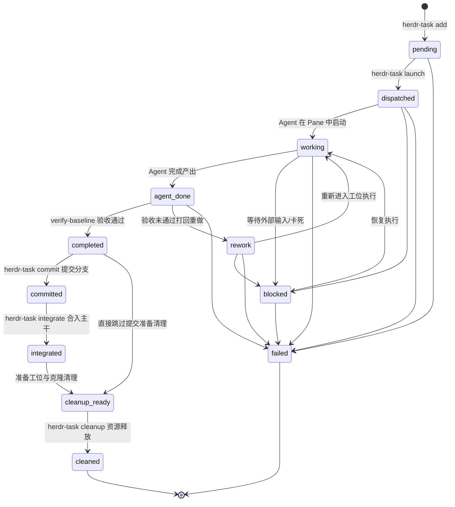

# 任务生命周期与基线验收机制 (task-lifecycle.md)

> **公司：上海共事智能科技有限公司**  
> **品牌：共事**  
> **产品：HAFlow**  
> **一句话：让人和多个 AI Agent 一起把事情做完**  
> *Human + Agent, in Flow*  
> **任务 11 状态机、CoW 克隆隔离与基线快照验收**  
> 关联索引: [[index]] | [[system-overview]] | [[domain-model]] | [[dag-workflow-engine]]

---

## 1. 任务状态机 (Task State Machine)

`FACT` HAFlow 任务生命周期严格由 11 个离散状态及其状态转换矩阵（`TRANSITIONS`）定义，任何越权状态变更将被 CLI 直接拦截。

Evidence:
- `herdr/transitions.py:TASK_TRANSITIONS, WORKFLOW_TRANSITIONS, validate_task_transition`
- `herdr/kernel.py:transition_task, transition_workflow`
- `herdr/state_db.py:transition_task, transition_workflow`
- `bin/herdr-task:set_status, supersede_task`

### 1.1 门禁结论 (Gate Verdict) 与 fix-loop

`FACT` 门禁阶段（test/review/wrapup，`GATE_DEFAULTS`；节点/全局 stage-policy
的 `gate` 配置可覆盖）验收落盘时携带机器可读结论：
`herdr-task set <task> completed --verdict pass|blocked --note "<blocker 清单>"`
（blocked 必填 note），持久化为任务的 `stage_verdict` / `stage_verdict_note`。

`FACT` Controller 在两处消费 verdict（fail-safe 语义：节点内任一未 superseded
任务的 blocked 即 blocked；无 verdict 时 lenient 放行，存量 workflow 行为不变）：

1. **阶段推进门禁**（`blocked_gate_dependency`）：ready_node 的依赖中存在
   blocked 门禁 → 不推进，执行**原子作废**——gate 节点及其全部下游节点的
   非 superseded 任务被 supersede（completed/cleanup_ready 先 finalize 规范化，
   规避 `completed→superseded` 非法转移窗口；pending/committed 跳过），随后
   投递一次 `fix_loop` 事件（含 blocker 清单、建议 `--onto` 分支、launch 骨架、
   循环计数）。作废使相关节点回归未完成——节点未完成本身就是闩，周期 sweep
   不会重发；fix 完成后 DAG 自动按 test→review→wrapup 顺序重流。
2. **交付终态门禁**：全部节点完成后，任一门禁节点 verdict=blocked → 不打
   `[WORKFLOW COMPLETE]`、不触发 auto-close，走同样的回流。

`FACT` 循环计数记录于 stage-state（`<wf>|fixloop|<retry_node>`，持锁写入），
超过 `HERDR_FIX_LOOP_MAX`（默认 3）后 fix_loop 事件切换为"必须请示用户"的
升级文案——上限是纪律+通知，非引擎硬闸。

`FACT` `close-workflow` 遇未作废的 blocked verdict 拒绝执行（exit 2）；显式
`--abandon` 可放弃交付（记录 workflow `outcome: abandoned`，正常关闭记录
`delivered`）。console 的 `create_candidate`（真实 git merge）与
`manual_advance` 对 blocked verdict 一律拒绝——三处旁路封堵。

`FACT` `reopen-workflow` 重开已关闭 workflow：`suppress_auto_close` 闩封住
reopen 后旧任务仍全为完成系导致的 sweep 自消除窗口，任一任务进入 ACTIVE
时摘除（`bin/herdr-task set_status`）。

Evidence:
- `services/herdr-controller.py` #resolve_gate_config / #gate_verdict /
  #invalidate_for_fix_loop / #handle_fix_loop / #build_fix_loop_message
- `bin/herdr-task` #set_status（verdict 落盘）/ #close_workflow（--abandon、
  outcome）/ #reopen_workflow / #_clear_suppress_auto_close
- `console/herdr_factory_console.py` #create_candidate / #manual_advance
- `tests/test_fix_loop_pr1.py`、`tests/test_fix_loop_gates.py`

### 1.2 Trajectory Ledger：一次执行的历史事实流

`FACT` Task 的当前状态仍由 Runtime State/StateStore 表示；Trajectory Ledger
只记录已经发生的历史事实，不参与状态机判定、调度或 Observer 决策。一次正常
`herdr-task launch` 在构造 task 时先生成新的 `run_id`，并在 `save_tasks()`
之前写入 task；因此 `run_id` 表示一次完整的 Workflow/Task 执行实例，不能与
`task_id`、`agent_session_id` 或 `workspace_id` 混用。真正没有该字段的历史旧
task 才使用 `run_<task_id>` 兼容 fallback。

Trajectory 事件复用现有 SQLite `events` 表，由 `herdr/trajectory.py` 的
`TrajectoryLedger` 提供 append-only `append_event()` 与按 run 查询的
`list_events(run_id)`。同一 run 的事件使用持久化 sequence 恢复顺序；
`source=trajectory` 的事件不改变既有 StateStore 通用事件查询语义。

典型生命周期是：

1. launch 持久化 task 后写入 `run_started`、`task_started`、`agent_started`；
2. Task 状态真实变化时写入 `task_status_changed`；
3. evaluator 产生 `tests_completed` 事实时写入 `verification_completed`，其中
   `verification.passed` 直接使用 evaluator 的 `converged`，并保留有界的
   failing/lint/type/composite/evidence_id 字段；
4. Task/Run 终态写入 `task_completed`、`task_failed`、`run_completed` 或
   `run_failed`（仅在现有执行路径能够确认时记录）。

这些事件与 Runtime State 分层：Runtime State 回答“现在是什么状态”，Ledger
回答“这次执行之前发生过什么”，Observer 或后续分析器可直接按 run 重放事实流。

`FACT` 在 Ledger 之上，Trajectory Observer（[[trajectory-observer]]）按
`run_id` 读取事实流 + Runtime + bounded 日志，输出结构化 Finding
（`trajectory_findings` 表，与 events 事实表物理分离）；它只检测/解释/建议，
绝不改变任务状态机或调度。

Evidence:
- `herdr/trajectory.py:TrajectoryEvent, TrajectoryLedger, run_id_for_task`
- `bin/herdr-task:_launch_task`
- `services/herdr-controller.py:check_task_tests_completed`
- `herdr/state_db.py:record_trajectory_event, list_trajectory_events`
- `tests/test_trajectory.py`
- `tests/test_supervisor_tests_completed.py`

---

## 2. CoW (Copy-on-Write) 沙盒隔离机制

`FACT` 任何研发修改类任务绝不在项目主干目录执行，而必须在独立克隆中运行：
- **物理路径**: `~/.herdr-controller/clones/<task-id>`
- **秒级克隆实现**: 在 macOS APFS 文件系统上，调用底层 `cp -cR <source_project> <clone_path>` 实现毫秒级、零初始磁盘占用的 Copy-on-Write 克隆。
- **分支规范**: 在克隆目录中切换至任务专属分支：  
  `agent/{agent}/{task_type}-{slug_task_id}`（如 `agent/codex/feat-task-001`）。

Evidence:
- `services/herdr-worker.py#create_clone`
- `services/herdr-worker.py#create_task_branch`
- `RULES.md:空间隔离红线`

### 2.1 Context 模式的 Task Workspace（无 Git 执行路径）

`FACT` 当模板声明 `execution.mode: context` 时，Task 不走 CoW Clone/Branch：
- **物理路径**: 仍为 `~/.herdr-controller/clones/<task-id>`（与 CoW clone 同根同级，
  使 `delete_clone_safely`/retention/finalize 生命周期零改动复用）。
- **装配**: `create_context_task_workspace` 只创建纯目录；`branch=None`、
  基线指纹为空集合（context 任务的一切文件生来都是"本任务产出"）。
- **只读引用**: Context 绑定路径以短小 "Workflow Context" 块注入派发 prompt
  （id + 绝对路径），Agent 按任务需要自行读取，系统不展开文件内容/不做 RAG；
  Agent 严禁写入 context 原始目录（客户工作区），产物只落 Task Workspace。
- **验收**: `verify-baseline` 在 context 模式改用 `context_workspace_fingerprint`
  （全文件按 untracked 计的递归 SHA256 指纹，过滤 `.agent-task-context`/
  `.herdr-loop`/`.git` 等内部装配文件），TASK_CHANGED/BASELINE_MATCH 协议不变。
- **防呆**: commit/integrate 对 context 任务 fail-fast exit 2。

Evidence:
- `services/herdr-worker.py#create_context_task_workspace`
- `bin/herdr-task#context_workspace_fingerprint`
- `tests/test_execution_context_contract.py`

---

## 3. 基线指纹快照 (Baseline Fingerprint) 核心机制

### 3.1 为什么普通 `git status` 在沙盒中会产生严重误判？
> [!IMPORTANT]
> **代码中的核心隐性知识**  
> 当开发者或主干工作区在派发任务前存在尚未提交的改动或未跟踪文件时，`cp -cR` 会将这些主干未提交文件**一并完整克隆到沙盒中**！  
> 如果在沙盒中仅仅执行普通的 `git status`，所有主干原有的未提交文件都会被列出，导致验收工具或 Agent 误以为这些文件都是当前 Task 的修改产出。

### 3.2 基线指纹解决方案
`FACT` Herdr 通过任务启动瞬间的指纹采样来解决此问题：
1. **采样阶段 (`build_baseline_fingerprint`)**:
   - 任务派发瞬间，Worker 扫描克隆目录中已跟踪的脏文件（`git diff --name-only -z HEAD`）和未跟踪文件（`git ls-files --others`）。
   - 对每个文件内容计算 SHA1 校验和，形成快照并记录入 `tasks.json` 的 `baseline_fingerprint` 字段。
   - 特殊规则：内部控制文件 `.agent-task-context` 自动从指纹中过滤。
2. **验收阶段 (`verify-baseline`)**:
   - 运行 `./bin/herdr-task verify-baseline <task-id>`。
   - 系统将当前克隆文件状态与 `baseline_fingerprint` 进行逐项对比。
   - 只有真正由 Agent 在任务期间修改或新增的文件，才会归入 `TASK_CHANGED` 列表。
   - 若未发生任何实质改动，报告 `BASELINE_MATCH`，拒绝盲目合并。

Evidence:
- `services/herdr-worker.py#build_baseline_fingerprint`
- `bin/herdr-task#cmd_verify_baseline`
- `CLAUDE.md:坑点 2：CoW Clone 变化识别与验收假象`

---

## 4. E2E 自动化测试验收的特殊规则

`FACT` 在针对工作流进行 E2E 自动化测试时（如 `workflow_id` 以 `e2e-` 开头）：
- 终端 CLI 在 alternate-screen（备用屏幕缓冲）模式下运行，可能导致 `herdr pane read` 读到的终端可见内容暂时为空白。
- 验收准则：**严禁依赖终端是否能读取到固定文本**。
- 只要 Herdr 任务生命周期到达 `agent_done`，且 `verify-baseline` 返回变更合规，即判定任务成功，直接流转为 `completed`，禁止因屏幕空白打回 `rework`。

Evidence:
- `workflow_templates/software-development-v1.yaml:rules`
- `workflow_templates/bidding.yaml:rules`

---

## 5. 物理收尾与证据固化 (Physical Teardown)

`FACT` 任务遵循"生而隔离,死而清零"生命周期:出生时独立 pane + CoW clone +
全新 agent 会话;验收收敛后由 `finalize` / `close-workflow` 执行物理销毁。
上下文只在任务体内生存,跨任务合法信息通道收敛为两类:
1. **固化产物**:git commits / integration branch / 转写证据 / 任务记录;
2. **Workflow 共享文档区**（受控共享,2026-09-18 引入）:追加式账本
   `~/.herdr-controller/workflows/<workflow_id>/shared/notes.jsonl`,
   代码仍物理隔离,文档/证据按 workflow 共享。权威层级为
   `git commits / verify-baseline > controller 机器证据 > 本区文档(仅上下文)`；
   stale 在读取时计算(base 漂移作废 evidence/gate;fix-loop 作废早于作废点的
   目标节点条目);controller 在派发时按节点相关度注入 prompt。
pane 从不复用——`_claimed_panes` 的永久占用是该原则的执行机制,而非缺陷。

Evidence:
- `herdr/workflow_docs.py` (append/load/annotate/summarize/render)
- `bin/herdr-task` #note_add/#note_list/#_record_gate_note
- `services/herdr-controller.py` #shared_docs_block/#_record_invalidation_note
- `services/herdr-worker.py` #write_task_context (shared_docs 注入)

### 5.1 finalize 序列(幂等)

1. **闸门**:仅允许非活跃状态;`failed` 需 `--force`。
2. **证据先行**:herdr 不持久化终端 scrollback,销毁 pane 前必须
   `pane read --source recent-unwrapped` dump 到
   `~/.herdr-controller/logs/tasks/<task_id>/terminal.log`(+ `meta.json` 含 agent_session)。
3. `pane close`;4. clone 处理;5. 状态沿 `completed→cleanup_ready→cleaned` 推进。

### 5.2 clone 删除安全档位

- 有 `integration_ref/branch`(已完成 integrate)或 `superseded` → 可删;
- `committed` 未 integrate → 拒删(commit 仅存于 clone);
- mode=none 的 docs/test/review 任务无 integration 通道 → 默认保留,
  `--purge-clones` 显式授权后才删。

### 5.3 close-workflow、所有权预占与共享 tab 守卫

`herdr-task close-workflow <wf>`:
1. **Preflight 门禁与所有权预占**: 首先执行 `validate_workflow_transition(cur_status, "closing", force=force)` 前置校验，通过后在任何物理清理前原子将工作流状态推进为 `closing`；在 `closing` 状态下并发 `pause` 会被状态机天然拒绝，消除物理现场已毁但工作流停在 paused 的 TOCTOU 竞态；
2. **活跃任务闸门与逐任务 finalize**;
3. **关阶段 tab（共享 tab 守卫）**: 连续 workflow 常复用同一 workspace 的阶段 tab, 关 tab 前必须校验 tab 内全部存活 pane 均属本 workflow(锚点 + 本 workflow 任务); 有外来 pane 或 pane list 不可用时跳过该 tab 并写入报告 `tabs_skipped`；
4. **终态流转**: 物理资源销毁完成后，通过 Gateway 将工作流从 `closing` 原子推进为 `completed`；
5. **清 stage-state 并输出收尾报告**。
- **总指挥 pane 例外**: 默认保留至知识沉淀 + PR 合并后由 `--include-coordinator` 关闭。
- **自动触发**: Controller 在 `is_workflow_completed` 时后台调用 `close-workflow`(in-flight 防重入 + status=completed/closing 短路); 零任务的已登记运行视为平凡完成。

Evidence:
- `bin/herdr-task#finalize_task` `#close_workflow` `#_tab_foreign_panes` `#dump_transcript`
- `services/herdr-controller.py#maybe_close_completed_workflow`
- `docs/walkthroughs/20260913-workflow-finalize.md`
