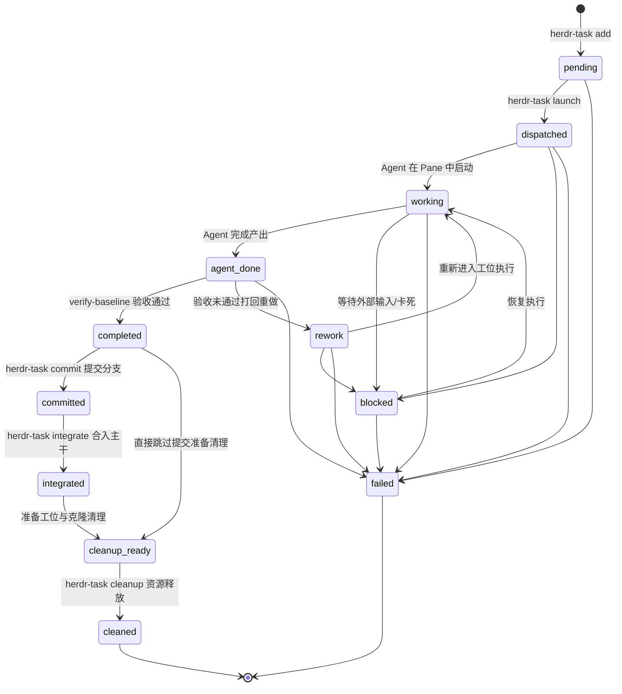

# 任务生命周期与基线验收机制 (task-lifecycle.md)

> **公司：上海共事智能科技有限公司**  
> **品牌：共事**  
> **产品：HAFlow**  
> **一句话：让人和多个 AI Agent 一起把事情做完**  
> *Human + Agent, in Flow*  
> **任务 11 状态机、CoW 克隆隔离与基线快照验收**  
> 关联索引: [[index]] | [[system-overview]] | [[domain-model]] | [[dag-workflow-engine]]

---

## 1. 任务状态机 (Task State Machine)

`FACT` HAFlow 任务生命周期严格由 11 个离散状态及其状态转换矩阵（`TRANSITIONS`）定义，任何越权状态变更将被 CLI 直接拦截。

```mermaid
stateDiagram-v2
    [*] --> pending: herdr-task add
    pending --> dispatched: herdr-task launch
    pending --> failed

    dispatched --> working: Agent 在 Pane 中启动
    dispatched --> blocked
    dispatched --> failed

    working --> agent_done: Agent 完成产出
    working --> blocked: 等待外部输入/卡死
    working --> failed

    blocked --> working: 恢复执行
    blocked --> failed

    agent_done --> completed: verify-baseline 验收通过
    agent_done --> rework: 验收未通过打回重做
    agent_done --> failed

    rework --> working: 重新进入工位执行
    rework --> blocked
    rework --> failed

    completed --> committed: herdr-task commit 提交分支
    completed --> cleanup_ready: 直接跳过提交准备清理

    committed --> integrated: herdr-task integrate 合入主干
    integrated --> cleanup_ready: 准备工位与克隆清理

    cleanup_ready --> cleaned: herdr-task cleanup 资源释放
    cleaned --> [*]
    failed --> [*]
```

Evidence:
- `herdr/transitions.py:TASK_TRANSITIONS, WORKFLOW_TRANSITIONS, validate_task_transition`
- `herdr/kernel.py:transition_task, transition_workflow`
- `herdr/state_db.py:transition_task, transition_workflow`
- `bin/herdr-task:set_status, supersede_task`

`FACT` 当前内循环耗尽的blocked是等待仲裁的持久事实，Agent working/idle/done不能代替明确恢复决策。实时事件保留该状态；重启在已知运行信号下恢复仲裁队列。最新blocked转换reason优先于可遗留的sentinel_reason；历史缺失时保留legacy行为。证据：`tests/test_inner_loop_arbitration_recovery.py`。旧屏幕跨恢复epoch（C03c）仍单独待修。仲裁卡及人工升级提示使用现有合法blocked→working命令，不增状态边或force；真实CLI参数执行回归见`tests/test_blocked_recovery_command_contract.py`（C30）。

### 1.1 门禁结论 (Gate Verdict) 与 fix-loop

`FACT` 门禁阶段（test/review/wrapup，`GATE_DEFAULTS`；节点/全局 stage-policy
的 `gate` 配置可覆盖）验收落盘时携带机器可读结论：
`herdr-task set <task> completed --verdict pass|blocked --note "<blocker 清单>"`
（blocked 必填 note），持久化为任务的 `stage_verdict` / `stage_verdict_note`。

`FACT` Controller 在两处消费 verdict（fail-safe 语义：节点内任一未 superseded
任务的 blocked 即 blocked；无 verdict 时 lenient 放行，存量 workflow 行为不变）：

1. **阶段推进门禁**（`blocked_gate_dependency`）：ready_node 的依赖中存在
   blocked 门禁 → 不推进，执行**原子作废**——gate 节点及其全部下游节点的
   非 superseded 任务被 supersede（completed/cleanup_ready 先 finalize 规范化，
   规避 `completed→superseded` 非法转移窗口；pending/committed 跳过），随后
   投递一次 `fix_loop` 事件（含 blocker 清单、建议 `--onto` 分支、launch 骨架、
   循环计数）。作废使相关节点回归未完成——节点未完成本身就是闩，周期 sweep
   不会重发；fix 完成后 DAG 自动按 test→review→wrapup 顺序重流。
2. **交付终态门禁**：全部节点完成后，任一门禁节点 verdict=blocked → 不打
   `[WORKFLOW COMPLETE]`、不触发 auto-close，走同样的回流。

`FACT` 循环计数记录于 stage-state（`<wf>|fixloop|<retry_node>`，持锁写入），
超过 `HERDR_FIX_LOOP_MAX`（默认 3）后 fix_loop 事件切换为"必须请示用户"的
升级文案——上限是纪律+通知，非引擎硬闸。

`FACT` `close-workflow` 遇未作废的 blocked verdict 拒绝执行（exit 2）；显式
`--abandon` 可放弃交付（记录 workflow `outcome: abandoned`，正常关闭记录
`delivered`）。console 的 `create_candidate`（真实 git merge）与
`manual_advance` 对 blocked verdict 一律拒绝——三处旁路封堵。

`FACT` `reopen-workflow` 重开已关闭 workflow：`suppress_auto_close` 闩封住
reopen 后旧任务仍全为完成系导致的 sweep 自消除窗口，任一任务进入 ACTIVE
时摘除（`bin/herdr-task set_status`）。

Evidence:
- `services/herdr-controller.py` #resolve_gate_config / #gate_verdict /
  #invalidate_for_fix_loop / #handle_fix_loop / #build_fix_loop_message
- `bin/herdr-task` #set_status（verdict 落盘）/ #close_workflow（--abandon、
  outcome）/ #reopen_workflow / #_clear_suppress_auto_close
- `console/herdr_factory_console.py` #create_candidate / #manual_advance
- `tests/test_fix_loop_pr1.py`、`tests/test_fix_loop_gates.py`

### 1.2 Trajectory Ledger：一次执行的历史事实流

`FACT` Task 的当前状态仍由 Runtime State/StateStore 表示；Trajectory Ledger
只记录已经发生的历史事实，不参与状态机判定、调度或 Observer 决策。一次正常
`herdr-task launch` 在构造 task 时先生成新的 `run_id`，并在 `save_tasks()`
之前写入 task；因此 `run_id` 表示一次完整的 Workflow/Task 执行实例，不能与
`task_id`、`agent_session_id` 或 `workspace_id` 混用。真正没有该字段的历史旧
task 才使用 `run_<task_id>` 兼容 fallback。

Trajectory 事件复用现有 SQLite `events` 表，由 `herdr/trajectory.py` 的
`TrajectoryLedger` 提供 append-only `append_event()` 与按 run 查询的
`list_events(run_id)`。同一 run 的事件使用持久化 sequence 恢复顺序；
`source=trajectory` 的事件不改变既有 StateStore 通用事件查询语义。

典型生命周期是：

1. launch 持久化 task 后写入 `run_started`、`task_started`、`agent_started`；
2. Task 状态真实变化时写入 `task_status_changed`；
3. evaluator 产生 `tests_completed` 事实时写入 `verification_completed`，其中
   `verification.passed` 直接使用 evaluator 的 `converged`，并保留有界的
   failing/lint/type/composite/evidence_id 字段；
4. Task/Run 终态写入 `task_completed`、`task_failed`、`run_completed` 或
   `run_failed`（仅在现有执行路径能够确认时记录）。

这些事件与 Runtime State 分层：Runtime State 回答“现在是什么状态”，Ledger
回答“这次执行之前发生过什么”，Observer 或后续分析器可直接按 run 重放事实流。

`FACT` 在 Ledger 之上，Trajectory Observer（[[trajectory-observer]]）按
`run_id` 读取事实流 + Runtime + bounded 日志，输出结构化 Finding
（`trajectory_findings` 表，与 events 事实表物理分离）；它只检测/解释/建议，
绝不改变任务状态机或调度。

Evidence:
- `herdr/trajectory.py:TrajectoryEvent, TrajectoryLedger, run_id_for_task`
- `bin/herdr-task:_launch_task`
- `services/herdr-controller.py:check_task_tests_completed`
- `herdr/state_db.py:record_trajectory_event, list_trajectory_events`
- `tests/test_trajectory.py`
- `tests/test_supervisor_tests_completed.py`

### 1.3 完成标记的折行容错契约 (Wrap-Tolerant Marker Detection)

`FACT` `working → agent_done` 的唯一常驻通路是「Pane 可见屏幕上出现
`HERDR_TASK_DONE:<task_id>` + `agent_status == idle` + elapsed ≥ 60s + 两次
间隔确认」。Sentinel 只写 `completion_observations` 样本，Controller 独占
`compare_and_set_completion_transition` 的 CAS 落盘（见 §1.2 的 FR-1 分层）。

`DECISION` **Pane 是被硬折行的终端屏幕，不是逻辑文档。** TUI 消息体自带左边距，
折行的续行必然以水平缩进开头。因此：

- 标记探测的唯一接缝是纯函数 `herdr.completion.marker_present()`；
- 探测前只消解**缩进续行**（`\r?\n[ \t]+(?=\S)`），硬换行（空行、纯空白行、
  无缩进行）**保留换行符**，因此无关文本永远无法被拼成假标记；
- 命中后必须做**标识符边界校验**：`...-v1` 不得满足 `...-v1b`，跨 Task 证据
  不得完成别人的 Task；
- 三个前缀共用同一接缝：`HERDR_TASK_DONE:` / `HERDR_TASK_BLOCKER:` /
  `HERDR_ORCH_TASK:`。

`WHY` 历史上两个守护进程各自用 `literal in screen` 裸子串匹配。标记长度
= 16 + `len(task_id)`，`plan-arch-*`（51 字符）单行放下所以正常，
`plan-adversarial-*`（58 字符）超宽被折成两行 → `marker_present` 恒为 False →
`consecutive_samples` 恒为 0 → CAS 永远以 `completion_marker_absent` 拒绝 →
**产物与台账全部落盘、Agent 已 idle 的任务仍永久卡在 `working`，节点永不推进**。
该缺陷与产物质量无关，只取决于 `task_id` 长度与 Pane 宽度之差，属可复现的活性空洞。

`GUARD` 纯层测试（`tests/test_completion_marker_wrapping.py`）只覆盖函数行为；
防复发的真正门禁是**源码级契约**：任一守护进程重新内联 `f"HERDR_TASK_DONE:{task_id}"`
即测试失败（`test_daemon_has_no_raw_marker_substring_check`）。

Evidence:
- `herdr/completion.py:marker_present, marker_literal, _SOFT_WRAP_RE`
- `services/herdr-sentinel.py:main` (done / blocker / orch 三处探测)
- `services/herdr-controller.py:_completion_marker_snapshot`
- `herdr/state_db.py:compare_and_set_completion_transition`（`completion_marker_absent` 拒绝分支）
- `tests/test_completion_marker_wrapping.py`
- `docs/lessons/lessons-learned.md` §100

### 1.4 陈旧观测的 CAS 前置跳过

`FACT` §1.3 的完成观测走 `compare_and_set_completion_transition`，观测校验、CAS 与
观测消费在**同一个 SQLite 写事务**内完成，因此不会重试同一份样本。

`DECISION` **blocked 观测读在事务外**，必须自己承担漂移。`herdr-task set-status`、
人工 reopen、其它 Controller 写入都会抬 `tasks.version`；此后那份
`blocked_marker_observed` 样本的 `observed_version` 永远对不上。发起一次已知不可能
赢的 CAS、再记一条拒绝事件，然后下一轮 sweep 原样重来 —— 实测
`impl-t6-mock-retire` 刷出 **238 条完全相同的 `blocked_observation_cas_rejected`，
跨 25 分钟零进展**，最终成功纯靠 Sentinel 碰巧再次看见标记。

`RULE` 能否发起 CAS 由纯函数 `herdr.completion.observation_is_current()` 前置判定：

- `observed_status` / `observed_version` 任一与权威行不符 → **静默跳过**，等 Sentinel
  补新样本；不打事件、不占用转换预算；
- 非预期拒绝（判据说该赢却没赢）仍记录，但按 `(task_id, observed_version)` **去重**，
  一个样本一条事实；
- 缺 version（样本侧或权威侧）→ 返回 True 交由权威 CAS 裁决，避免用缺字段误杀新鲜样本；
- 非法 version（`"v5"` / `""` / 非数字）→ 判为陈旧，fail-closed。

`GUARD` 判据是"只减少明知会拒的尝试"，**不放宽任何已有拒绝**。陈旧闩与去重表在任务
离开 active 状态时清键，避免进程内 map 随任务数无界增长。

Evidence:
- `herdr/completion.py:observation_is_current`（纯判据，与 `cas_allows` 同居 FR-1 契约层）
- `services/herdr-controller.py:process_blocked_observations`（前置跳过 + 去重 + 清键）
- `tests/test_blocked_observation_cas_storm.py`（15 passed，含反向验证）
- `docs/lessons/lessons-learned.md` §101

---

### 1.5 StateStore 命名空间与 JSON 投影

`FACT` CLI 的隐式 tasks/workflows 投影跟随选定 SQLite 实例父目录；只有显式环境、模块或函数参数路径覆盖此目标。默认 workflow.json 保留配置读取职责，不作为显式数据库选址覆盖。steering 的隐式 tasks/steering 投影、SQLite 默认全量导出和 opt-in JSON 迁移同样跟随实例父目录。

`FACT` opt-in迁移对缺失配套文件仍传所选路径；不得将缺失转换成None，否则底层迁移将其解释为宿主默认输入。存在性由迁移reader判断；显式源路径仍有效。

`GUARD` 测试只设置临时 HERDR_STATE_DB 时不能读入或覆盖宿主默认JSON；显式目标路径仍按既有契约生效。本地修复不自动修复已经损坏的生产投影，也不改变SQLite权威来源。

Evidence:
- `bin/herdr-task:TASKS_FILE, WORKFLOWS_FILE, _get_store, save_tasks`
- `herdr/steering.py:get_tasks_file, get_steering_file, save_steering_data`
- `herdr/state_store.py:resolve_tasks_projection_file, _maybe_auto_migrate, export_all_json`
- `tests/test_state_projection_namespace.py`
- `docs/lessons/lessons-learned.md` §91复发补证

### 1.6 评估脚本步骤隔离

`FACT` `init_loop`生成的test/lint/repro命令分别在子shell执行，完整stdout/stderr重定向到对应日志。cd/export/exit仅影响该步骤，外层读取真实退出码后继续其它检查。步骤命令内容保留。

`FACT` 单次执行还要求外层runner成功、每个所需步骤唯一且有效的回执及本轮可读日志。程序生成的GOAL复现配置决定必需步骤；旧repro契约已移除时不复用旧日志。整体执行失败否决收敛并写原子EVAL_DONE与求助单；绿色测试数和有效lint基线语义保留。

`FACT` eval/init/基线写入在工位评估命名空间复用既有内核文件锁，竞争者busy退出75，不改持有者产物；持有者异常或进程退出后锁释放。日志新鲜性检查在所有权内执行。评分仍不是业务验收报告；runner与lint基线采集复用`run_evaluation_command`，在新session启动，超时/中断/异常/正常返回清理本次进程组后释放锁；TERM有限等待，必要时KILL。基线采集持锁覆盖命令和写入，超时不写基线，作用域内主线程SIGTERM可清理并恢复原handler。不可捕获SIGKILL及主动脱离session的子进程不在本地保证内。

`FACT` 原生CLI与Task自动初始化启用init_loop(capture_baseline=True)，同一锁覆盖初始化、旧baseline失效、受管采集和发布。默认standalone init不执行命令，仍清除旧契约债务；缺基线保守按0。CLI超时失败，Task继续保留既有best-effort告警/启动契约。missing-linter、历史receipt故障顺序与自由文本配置另卡，不以这一修复声明已全部关闭。

`FACT` 初始化先发布旧回执history并校验同hash内容，再失效current，最后换输入；history故障/中断保留旧契约及current，重试不丢原始字节。当前重置失败/新GOAL失败不允许旧成功被解释为新契约证据；相关测试`tests/test_loop_history_publication.py`。

`FACT` Supervisor的现代工位摘要状态/count统一来自单份EVAL_DONE，遗留BLOCKER仅当前exhausted时可报告存在；坏/薄/不可读receipt unknown不回退显示文件，只有absent receipt保留legacy兼容（非跨文件原子性）。共享reader服务extract和summary，各一次原子读取。验证`tests/test_loop_current_summary.py`。

`FACT` 测试隔离默认禁Observer模型，单例不继承host Jev凭据；假key cleanup必须精确restore absence/value，确定性gateway明示零transport。本机provider失败测试明确opt-in，生产配置不变。入口`tests/test_model_test_environment_isolation.py`。

`FACT` 测试日志进入parser前复用终端ANSI清洗，仅内存解析视图规范化，磁盘日志原字节保留；绿色标记的FAIL/✕名称不等于失败，真实失败/非零exit门禁不变。验证`tests/test_evaluator_ansi_test_output.py`。

`FACT` repro requirement来自GOAL末尾program typed标记，不扫描自由goal/DoD/command literal；旧格式仅唯一完整单行配置兼容，歧义goal_configuration_invalid需re-init。真实repro receipt/fresh log仍独立要求完整性。入口`tests/test_goal_repro_configuration.py`。

`FACT` 静态检查reserved退出124/126/127、负值及128以上不能被baseline抵扣，采集拒绝发布，评分与收敛独立否决旧污染baseline；工具实际exit1/2的历史欠账差值契约保留。验证入口`tests/test_lint_execution_failure_gate.py`。

`FACT` 自动npm默认测试命令为`CI=1 npm test`，避免继承Agent TTY时进入Vitest watch；显式任务命令完整保留。Java子任务测试范围仍须明确契约，不能从根package.json推断。

Evidence:
- `herdr/evaluator.py:init_loop`
- `tests/test_evaluator_step_isolation.py`
- `docs/lessons/lessons-learned.md` §110、§111
- `bin/herdr-loop:run_evaluation, _exit_receipts, _fresh_step_log`
- `herdr/evaluator.py:calculate_metrics, is_converged, generate_blocker_report`
- `tests/test_evaluator_runner_contract.py`
- `tests/test_evaluator_process_isolation.py`
- `tests/test_evaluator_process_cleanup.py`
- `tests/test_task_loop_noninteractive.py`
- `herdr/evaluator.py:run_evaluation_command, capture_lint_baseline`
- `tests/test_task_baseline_process_cleanup.py`
- `tests/test_loop_init_baseline_atomicity.py`

## 2. CoW (Copy-on-Write) 沙盒隔离机制

`FACT` 任何研发修改类任务绝不在项目主干目录执行，而必须在独立克隆中运行：
- **物理路径**: `~/.herdr-controller/clones/<task-id>`
- **秒级克隆实现**: 在 macOS APFS 文件系统上，调用底层 `cp -cR <source_project> <clone_path>` 实现毫秒级、零初始磁盘占用的 Copy-on-Write 克隆。
- **分支规范**: 在克隆目录中切换至任务专属分支：  
  `agent/{agent}/{task_type}-{slug_task_id}`（如 `agent/codex/feat-task-001`）。

Evidence:
- `services/herdr-worker.py#create_clone`
- `services/herdr-worker.py#create_task_branch`
- `RULES.md:空间隔离红线`

### 2.1 Context 模式的 Task Workspace（无 Git 执行路径）

`FACT` 当模板声明 `execution.mode: context` 时，Task 不走 CoW Clone/Branch：
- **物理路径**: 仍为 `~/.herdr-controller/clones/<task-id>`（与 CoW clone 同根同级，
  使 `delete_clone_safely`/retention/finalize 生命周期零改动复用）。
- **装配**: `create_context_task_workspace` 只创建纯目录；`branch=None`、
  基线指纹为空集合（context 任务的一切文件生来都是"本任务产出"）。
- **只读引用**: Context 绑定路径以短小 "Workflow Context" 块注入派发 prompt
  （id + 绝对路径），Agent 按任务需要自行读取，系统不展开文件内容/不做 RAG；
  Agent 严禁写入 context 原始目录（客户工作区），产物只落 Task Workspace。
- **验收**: `verify-baseline` 在 context 模式改用 `context_workspace_fingerprint`
  （全文件按 untracked 计的递归 SHA256 指纹，过滤 `.agent-task-context`/
  `.herdr-loop`/`.git` 等内部装配文件），TASK_CHANGED/BASELINE_MATCH 协议不变。
- **防呆**: commit/integrate 对 context 任务 fail-fast exit 2。

Evidence:
- `services/herdr-worker.py#create_context_task_workspace`
- `bin/herdr-task#context_workspace_fingerprint`
- `tests/test_execution_context_contract.py`

---

## 3. 基线指纹快照 (Baseline Fingerprint) 核心机制

### 3.1 为什么普通 `git status` 在沙盒中会产生严重误判？
> [!IMPORTANT]
> **代码中的核心隐性知识**  
> 当开发者或主干工作区在派发任务前存在尚未提交的改动或未跟踪文件时，`cp -cR` 会将这些主干未提交文件**一并完整克隆到沙盒中**！  
> 如果在沙盒中仅仅执行普通的 `git status`，所有主干原有的未提交文件都会被列出，导致验收工具或 Agent 误以为这些文件都是当前 Task 的修改产出。

### 3.2 基线指纹解决方案
`FACT` Herdr 通过任务启动瞬间的指纹采样来解决此问题：
1. **采样阶段 (`build_baseline_fingerprint`)**:
   - 任务派发瞬间，Worker 扫描克隆目录中已跟踪的脏文件（`git diff --name-only -z HEAD`）和未跟踪文件（`git ls-files --others`）。
   - 对每个文件内容计算 SHA1 校验和，形成快照并记录入 `tasks.json` 的 `baseline_fingerprint` 字段。
   - 特殊规则：内部控制文件 `.agent-task-context` 自动从指纹中过滤。
2. **验收阶段 (`verify-baseline`)**:
   - 运行 `./bin/herdr-task verify-baseline <task-id>`。
   - 系统将当前克隆文件状态与 `baseline_fingerprint` 进行逐项对比。
   - 只有真正由 Agent 在任务期间修改或新增的文件，才会归入 `TASK_CHANGED` 列表。
   - 若未发生任何实质改动，报告 `BASELINE_MATCH`，拒绝盲目合并。

Evidence:
- `services/herdr-worker.py#build_baseline_fingerprint`
- `bin/herdr-task#cmd_verify_baseline`
- `CLAUDE.md:坑点 2：CoW Clone 变化识别与验收假象`

---

## 4. E2E 自动化测试验收的特殊规则

`FACT` 在针对工作流进行 E2E 自动化测试时（如 `workflow_id` 以 `e2e-` 开头）：
- 终端 CLI 在 alternate-screen（备用屏幕缓冲）模式下运行，可能导致 `herdr pane read` 读到的终端可见内容暂时为空白。
- 验收准则：**严禁依赖终端是否能读取到固定文本**。
- 只要 Herdr 任务生命周期到达 `agent_done`，且 `verify-baseline` 返回变更合规，即判定任务成功，直接流转为 `completed`，禁止因屏幕空白打回 `rework`。

Evidence:
- `workflow_templates/software-development-v1.yaml:rules`
- `workflow_templates/bidding.yaml:rules`

---

## 5. 物理收尾与证据固化 (Physical Teardown)

`FACT` 任务遵循"生而隔离,死而清零"生命周期:出生时独立 pane + CoW clone +
全新 agent 会话;验收收敛后由 `finalize` / `close-workflow` 执行物理销毁。
上下文只在任务体内生存,跨任务合法信息通道收敛为两类:
1. **固化产物**:git commits / integration branch / 转写证据 / 任务记录;
2. **Workflow 共享文档区**（受控共享,2026-09-18 引入）:追加式账本
   `~/.herdr-controller/workflows/<workflow_id>/shared/notes.jsonl`,
   代码仍物理隔离,文档/证据按 workflow 共享。权威层级为
   `git commits / verify-baseline > controller 机器证据 > 本区文档(仅上下文)`；
   stale 在读取时计算(base 漂移作废 evidence/gate;fix-loop 作废早于作废点的
   目标节点条目);controller 在派发时按节点相关度注入 prompt。
pane 从不复用——`_claimed_panes` 的永久占用是该原则的执行机制,而非缺陷。

Evidence:
- `herdr/workflow_docs.py` (append/load/annotate/summarize/render)
- `bin/herdr-task` #note_add/#note_list/#_record_gate_note
- `services/herdr-controller.py` #shared_docs_block/#_record_invalidation_note
- `services/herdr-worker.py` #write_task_context (shared_docs 注入)

### 5.1 finalize 序列(幂等)

1. **闸门**:仅允许非活跃状态;`failed` 需 `--force`。
2. **证据先行**:herdr 不持久化终端 scrollback,销毁 pane 前必须
   `pane read --source recent-unwrapped` dump 到
   `~/.herdr-controller/logs/tasks/<task_id>/terminal.log`(+ `meta.json` 含 agent_session)。
3. `pane close`;4. clone 处理;5. 状态沿 `completed→cleanup_ready→cleaned` 推进。

### 5.2 clone 删除安全档位

- 有 `integration_ref/branch`(已完成 integrate)或 `superseded` → 可删;
- `committed` 未 integrate → 拒删(commit 仅存于 clone);
- mode=none 的 docs/test/review 任务无 integration 通道 → 默认保留,
  `--purge-clones` 显式授权后才删。

### 5.3 close-workflow、所有权预占与共享 tab 守卫

`herdr-task close-workflow <wf>`:
1. **Preflight 门禁与所有权预占**: 首先执行 `validate_workflow_transition(cur_status, "closing", force=force)` 前置校验，通过后在任何物理清理前原子将工作流状态推进为 `closing`；在 `closing` 状态下并发 `pause` 会被状态机天然拒绝，消除物理现场已毁但工作流停在 paused 的 TOCTOU 竞态；
2. **活跃任务闸门与逐任务 finalize**;
3. **关阶段 tab（共享 tab 守卫）**: 连续 workflow 常复用同一 workspace 的阶段 tab, 关 tab 前必须校验 tab 内全部存活 pane 均属本 workflow(锚点 + 本 workflow 任务); 有外来 pane 或 pane list 不可用时跳过该 tab 并写入报告 `tabs_skipped`；
4. **终态流转**: 物理资源销毁完成后，通过 Gateway 将工作流从 `closing` 原子推进为 `completed`；
5. **清 stage-state 并输出收尾报告**。
- `--accept-escalated` 是对已升级 Git Task 的人工确认，报告 outcome 为
  `escalated_accepted`；它允许物理收尾，但不提升 Task 集成状态。已提交未集成的
  Clone 必须保留，报告逐项列出 Pane 关闭结果、Task 状态和 Clone 保留原因；工作流
  完成 outcome 同样记录为 `escalated_accepted`。
- **总指挥 pane 例外**: 默认保留至知识沉淀 + PR 合并后由 `--include-coordinator` 关闭。
- **自动触发**: Controller 在 `is_workflow_completed` 时后台调用 `close-workflow`(in-flight 防重入 + status=completed/closing 短路); 零任务的已登记运行视为平凡完成。

Evidence:
- `bin/herdr-task#finalize_task` `#close_workflow` `#_tab_foreign_panes` `#dump_transcript`
- `services/herdr-controller.py#maybe_close_completed_workflow`
- `docs/walkthroughs/20260913-workflow-finalize.md`

### 5.4 Test/review delivery baseline 与 PR 交付核对

- test/review 在运行时资源创建前必须解析到唯一、有效的 workflow delivery；缺失、歧义或
  invalidated 候选一律 exit 2，并通过 StateStore 写 `test_baseline_rejected` actionable event。
- delivery 候选必须是 clone baseline 的 ancestor；无法证明时拒绝派发，不以 Agent 隔离策略
  替代 FR-6.2 baseline 门禁。
- `herdr-task check-delivery` 查询指定 head branch 的已合并 GitHub PR，并从 repo path 解析
  candidate/head tree。相同分支旧 PR SHA 与当前候选不同时输出非阻断 review warning；查询失败
  必须显式报告 evidence unavailable，不能声称无历史 PR。
- `integrate` 在写 `refs/herdr/tasks/<task>`、force branch 或 integration ref 前检查主仓 tracked
  状态；脏仓 exit 5 且不写 ref。
- Router 的 `router_opt_out_used` event 在实际选择 reused agent 后写入，`selected` 必须与返回
  给 CLI 的 agent 相同；审计失败仍 fail-closed。
- Sentinel SQLite 观察失败按旁路故障记录并继续下一轮；记录本身也失败时只写 stderr，不能让
  单次 SQLite 异常退出哨兵主循环。

### CoW Clone 来源为 Git Worktree

FACT: Worktree 根的 `.git` 是指向源仓库的文件，直接 CoW 复制会共享 HEAD 与 index。`create_clone` 在任何 reset、clean、branch 切换前，用 `git clone --no-hardlinks --no-checkout` 创建独立元数据并替换 Clone 中的指针；保留源 origin URL。普通 `.git` 目录仍使用 CoW 复制。

Evidence:
- `services/herdr-worker.py#create_clone`
- `tests/test_herdr_worker.py#TestCleanSandbox.test_worktree_source_clones_have_independent_git_state`

FACT: Herdr runtime `done` 与 `idle` 均表示可接收输入；完成策略接受两者，但仍要求新完成标记、两轮间隔采样、至少 60 秒、当前任务版本与 CAS。`done` 不是独立完成证据。

Evidence:
- `herdr/completion.py#should_accept`
- `herdr/state_db.py#observe_completion`
- `herdr/state_db.py#compare_and_set_completion_transition`
- `tests/test_impl_fix1_regression.py#test_done_runtime_completion_persists_with_existing_gates`

FACT: `agent/*-init` 是本地 Worktree 锚点，integrate 在现有 source/Clone 锁内 fetch source 的 `refs/heads/<base>` 到 Clone 的 `refs/herdr/bases/<task>`，再 rebase 和校验。普通分支仍 fetch origin。此操作不会把 anchor 推到远端，也不会改 source 的 HEAD/index；集成仍只导入 task/integration refs，后续候选合流另行处理。

Evidence:
- `bin/herdr-task#integrate_task`
- `tests/test_legacy_adopt_converge.py#IntegrateOutcomeTest.test_local_agent_anchor_integrates_without_remote_anchor`

FACT: 内循环评估的 Vitest/Jest 失败提取先识别行首✓/√通过标记，避免将用例名称中的FAIL/✕解释为失败；真失败与非零退出的评分门禁保留。

Evidence:
- `herdr/evaluator.py#_is_failing_test_line`
- `tests/test_loop_evaluator.py#EvaluatorTest.test_green_titles_with_failure_words_still_converge`
- `tests/test_loop_evaluator.py#EvaluatorTest.test_true_failure_is_retained_beside_green_failure_title`

### 实现完成与 Candidate 冻结的边界（2026-09-30）

Git 模式任务的 Agent 完成、提交成功和集成成功是三种事实。节点依赖完成须等到 integrated/cleanup_ready/cleaned；非 Git 任务保持既有完成集合。Controller、node-status 与 ops-center 复用 `scheduler.node_is_complete`，不得在 completed 时提前启动 verifier。

可在节点配置 `required_task_ids` 声明已批准计划的必需 Task。未派发项、缺失替代项、替代环拒绝完成；只沿真实 `superseded_by` 链解析替代，不按任务名猜谱系。没有配置清单时保持兼容。该清单由节点完成读取方实施，独立调用验证汇聚接口时仍须由调用者先完成节点依赖校验。

Worktree Clone 转换须保留 source 本地 heads，而不是只把它们映射到 origin/*；`--update-head-ok` 仅在临时 no-checkout 独立元数据导入时使用，不作用于 source。源 dev/anchor 落后于远端时仍需正常同步并重跑验证；保留分支不能代替新基线验收。Candidate 选择排除 superseded/有 superseded_by 的旧任务。

证据：`tests/test_scheduler_dispatch_e2e.py::PlannedImplementationCoverageTest`、`tests/test_herdr_task_ops_center.py::PlannedNodeStatusTest`、`tests/test_herdr_worker.py::TestCleanSandbox` 与 `docs/walkthroughs/20260930-candidate-recovery.md`。

## 阶段内交接义务巡检

FACT：`integrated` 是持久集成引用接收，不保证指定基线已采用成果。显式 `required_task_ids` 节点的所有现有任务结束后，Controller 每 30 秒检查缺失计划任务与 Git 成果采用状态；仅 `running` 且无活跃/阻塞任务时催办。Git 祖先核验绑定当次目标 SHA，总查询预算 3 秒，失败标记 `unknown`。

FACT：未完成义务保存在既有 attention episode，默认结束后 600 秒催办，间隔复用 `HERDR_ATTENTION_RETRY_INTERVAL`，同一义务最多进行两次实际协调投递；协调者持续不可用或仍无结果时升级人工。忙碌不消耗实际发送次数，人工通知失败保留待投递状态并按间隔重试。账本事务使用跨进程文件锁；重启重新检查事实，通知收到不关闭义务。队列执行前再次校验指纹、工作流状态和计划。复用启动时的 canonical coordinator name，按名称探测与投递，拒绝错误身份；探测 5 秒、投递 35 秒上限。慢巡检在独立单线程后台池运行，同时最多一个 scan，不阻塞正常阶段推进。沿真实 `superseded_by` 查替代任务，不从自由文本推断新 ID。

FACT：Console 的 stall 投影显示具体未派发任务与已接收但未确认采用的成果，返回 `continuation.deliveries[].adoption`（`adopted` / `not_adopted` / `unknown`）及 `target_sha`。巡检不直接合流、不启动 Task、不修改任务状态；协调者仍遵守原权限、串行屏障与候选门禁。

边界：仅适用于有显式任务清单（单节点最多 64 项）且已有任务的节点；超出该预算仍由原调度门禁处理，不执行此恢复路径。已经有直接后继任务时交给后继验收，不以原基线未采用误报。未声明清单的动态计划维持既有行为。Git 祖先证据不把 squash/cherry-pick 内容相似当作采用证明。

Evidence:
- `herdr/workflow_continuation.py#pending_continuations`
- `herdr/projects.py#inspect_continuation`
- `services/herdr-controller.py#check_workflow_continuation`
- `services/herdr-controller.py#handle_workflow_continuation`
- `herdr/projection.py#detect_workflow_stalls`
- `tests/test_workflow_continuation.py`

`FACT` 重新init在替换输入前原子失效当前EVAL_DONE，旧快照内容寻址归档history，仅本轮完成快照可被读为评估证据。证据ID含快照SHA，相同字节重启稳定；重置后的同计数不混用旧身份。升级可能重新观察一次旧快照，SHA不替代Task/run归属。证据：`tests/test_loop_reset_evidence_identity.py`（C31，本地验证，未部署）。

`FACT` 显式完整candidate SHA匹配本地--onto分支时，launch可接受未发布候选，并将同pin传给Worker；Worker在独立Clone检出前后重新核对。无pin续接仍要求origin，符号/缩写pin与移动分支拒绝，所有权/后续交付门禁保留。证据：`tests/test_pinned_local_onto.py`（C12，最终2682 passed/145 subtests，本地验证，未部署）。
